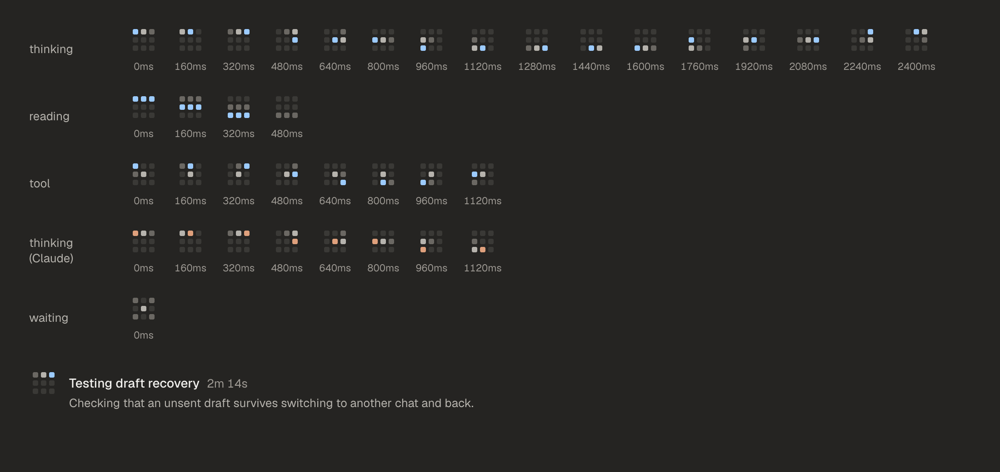
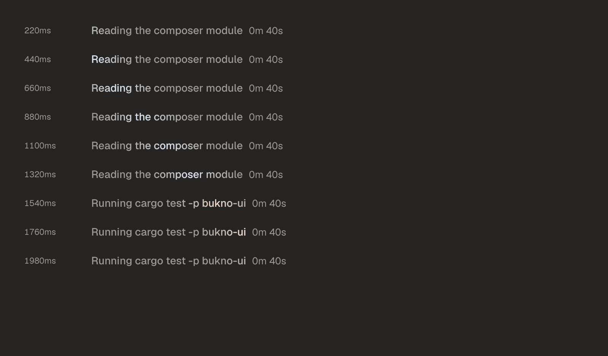

# Working animation proposal

Written 1 October 2026 after Pass 0. Status: **decided the same day.** Rasmus
chose the StreakLabel at 10 frames a second (decision 35). The BuildGrid and
the ThinkingOrb stay in the component set for reference.

## Why look again

In the native app the orb costs about 5 % of one CPU core while a run is
active (measured, see [the toolkit decision](../toolkit-decision.md)). egui
redraws the whole window for any animation, so the cost follows the number
of frames, about 0.26 % of a core per frame per second on the development
Mac. A smooth 20-frame loop cannot get under the proposed 3 % budget,
whatever it draws. The orb is also hard to slow down: its crisp dots judder
visibly below about 15 frames a second.

So a replacement should either change in a few deliberate steps, or move so
softly that a low frame rate still looks smooth.

## Ideas considered

| Idea | Verdict |
|---|---|
| Bookshelf: a row of spines lifting one at a time | Reads as an audio level meter, confusing once voice arrives |
| Constellation: dots joined by lines step by step | Pretty, but busy at 20 points |
| Blinking caret | Cheapest, but looks like the composer's text cursor |
| **BuildGrid**: nine blocks, work placed one block at a time | Kept. Stepped by design |
| **StreakLabel**: the activity words with a soft light passing through | Kept, from Rasmus's suggestion. Soft and slow |

## The two proposals

**[BuildGrid](system/components/BuildGrid/README.md)**: a 3 by 3 grid of
small rounded blocks. A three-block trail walks the grid (thinking), rows
light top to bottom (reading), one block turns around a held centre (tool),
and it rests still and neutral while waiting. Only the newest block takes the
provider colour. It changes in hard 160 ms steps (`step-working`). Bukno is
build plus knowledge, and the mark shows something being built.



**[StreakLabel](system/components/StreakLabel/README.md)**: no separate mark.
The real activity words ("Reading the composer module") rest in
`text-tertiary`, and a 120-point band of light passes through them once per
`loop-streak` (2200 ms). Its core is `text-primary` with just over a quarter
of the provider colour, so Codex work glints faintly blue and Claude work
faintly orange. Similar in spirit to ChatGPT's thinking label; the provider
glint and the fixed, soft band make it Bukno's own. It changes the system
rule that activity text never shimmers, because the words become the one
live element.



## Measured in the packaged app

The same workload as the orb measurement: the `working` scenario with only
the working treatment changing, 25 to 30 seconds per sample, process CPU
from `getrusage`. Samples where the frame rate shows the window was covered
or disturbed are left out and kept in the evidence folder.

| Treatment | Frames a second | CPU, one core |
|---|---|---|
| ThinkingOrb (approved) | 19.5 | 4.4 to 5.9 % |
| StreakLabel at 12 fps | 11.8 to 12.8 | 3.1 to 3.4 % |
| StreakLabel at 15 fps | not cleanly measured; about 4 % expected | |
| BuildGrid | 6.3 | 1.7 to 2.1 % |

Evidence: `dev/artifacts/bukno/2026-10-01/build-grid-comparison/`, and the
UI check `working_treatments` (frames at fixed moments plus the redraw
cadence: orb every 50 ms, BuildGrid only at its 160 ms step boundaries,
StreakLabel every 67 ms at 15 fps).

Follow-up at 10 fps, all samples at their frame cap: **StreakLabel 2.53 to
2.58 %**, 12 fps 2.95 to 2.96 %, 15 fps 3.7 %. Native recordings at 10, 12,
15 and 60 fps are produced by the UI check `streak_frame_rates`.

Decision: StreakLabel at 10 fps, under the 3 % budget with some headroom.

## How to look at them

In the browser, serve `docs/design` (see the [design README](README.md)) and
open `system/index.html` (BuildGrid, StreakLabel and the WorkingIndicator
cards), or `system/components/BuildGrid/frames.html` and
`system/components/StreakLabel/frames.html` for every step.

In the native app, after `cargo xtask package`:

```bash
BUKNO_WORKING_MARK=grid ~/Library/Caches/bukno/cargo-target/bukno-package/Bukno.app/Contents/MacOS/bukno --scenario working
```

```bash
BUKNO_WORKING_MARK=streak BUKNO_ORB_FPS=12 ~/Library/Caches/bukno/cargo-target/bukno-package/Bukno.app/Contents/MacOS/bukno --scenario working
```

The streak's smoothness at 12 fps needs a look on screen; the stills cannot
show it.

## Done after the decision

The `WorkingIndicator` defaults to the StreakLabel, the motion table in the
[system README](system/README.md) describes it, and the journey screens that
showed the orb (2.1, 2.2, 2.3, 3.1 to 3.3, 5.1) are re-exported. The native
app uses it by default at 10 fps; `BUKNO_WORKING_MARK=orb` or `grid` shows the
others.
