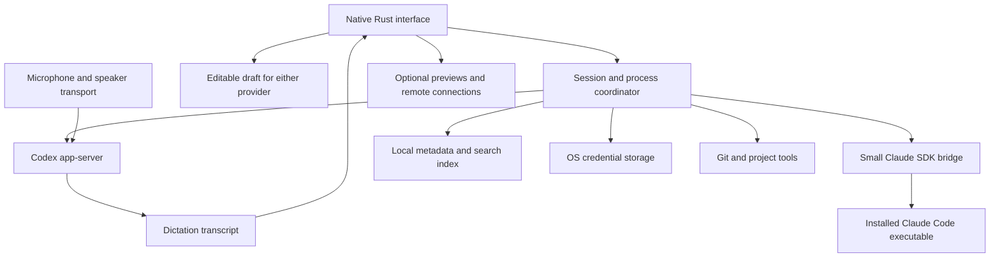

# Native Codex and Claude interface: feature map

Research draft, 30 September 2026. This is a proposed product scope and architecture, not an implemented application or a claim of complete desktop-app parity.

Build a lightweight, open-source native client for the installed Codex and Claude Code engines. Start with the everyday coding workflow and use Codex app-server for both realtime voice and shared dictation. Claude Code remains the second coding engine, controlled through its Agent SDK. There is no separate Claude voice service in scope. Keep expensive previews, audio models, and background agents inactive until needed.

Our existing audit measured roughly 5.2 GiB for the Codex desktop process family during its current workload. That is a useful motivation, but it is not a fair benchmark for a smaller replacement with fewer integrations. Performance comparisons must use the same workload and include all child processes.

## Architecture to start with

- Use a native Rust UI, such as egui, as the initial direction. Prototype text selection, long transcripts, accessibility, code rendering, and IME support before committing. Rust alone does not guarantee a small memory footprint.
- Use a provider adapter boundary. Preserve provider-specific capabilities, session IDs, permissions, and errors instead of forcing them into misleading equivalents.
- Let each engine own its conversation state. Store our project associations, labels, bookmarks, search index, drafts, and process ownership locally. Avoid keeping a second full transcript in memory.
- Start with local transport. Add remote hosts after local recovery and process lifecycle are dependable.
- Version-check engines at startup and negotiate available capabilities. Experimental voice needs a visible compatibility check.

Codex exposes structured application integration through [app-server](https://learn.chatgpt.com/docs/app-server). We should use that protocol rather than parse terminal rendering.

## Authentication and subscription boundaries

| Route | Intended use | What must be established |
|---|---|---|
| Sign in with ChatGPT for our client | Our own OAuth client for an eligible open-source/local application | Correct registration, browser login, credential storage, refresh, and successful inference |
| Existing Codex CLI authentication | Local installed-engine workflow | Compatibility with our client and each requested capability |
| Existing Claude Code installation | Personal/local sessions using the user's installed engine | Engine login, session resumption, limits, and applicable third-party distribution terms |
| Provider API keys | Optional alternative backend and API-only services | Separate billing and feature eligibility |

OpenAI documents [Sign in with ChatGPT for open-source applications](https://developers.openai.com/siwc/token-sharing-open-source) and an [app-server integration recipe](https://developers.openai.com/siwc/token-sharing-open-source/codex-app-server). Use our own honest client identity and token handling. It does not grant access to existing ChatGPT conversations. A model catalog entry is not proof of entitlement; complete an inference request.

The current [preview limitations](https://developers.openai.com/siwc/token-sharing-open-source/preview-limitations) distinguish local agent tools from hosted API tools. Hosted image generation, file search, Code Interpreter, native computer use, and hosted connectors are outside that route. Audio/video input and transcription are also excluded there. This does not establish the eligibility of Codex's separate experimental realtime transport; test that transport independently.

Claude's [Agent SDK overview](https://code.claude.com/docs/en/agent-sdk/overview) places restrictions on offering claude.ai login in third-party products without prior approval. Its [subscription-usage support article](https://support.claude.com/en/articles/15036540-use-the-claude-agent-sdk-with-your-claude-plan) also describes personal SDK/CLI use against plan limits and a paused usage-policy change. These are different questions: local usage versus shipping our own subscription-login offering. Reconcile that boundary before a public release. Do not advertise unconditional subscription support based on T3's implementation alone.

## App-server and SDK choices

Use Codex app-server directly from Rust over its structured local protocol. The [Codex SDK documentation](https://learn.chatgpt.com/docs/codex-sdk) explicitly recommends app-server for custom clients needing authentication, history, approvals, and streaming. Its Python SDK controls app-server; the inspected TypeScript SDK launches `codex exec` with JSON output. They are alternative integration layers, not two additional agent engines we need running beside app-server. We do not need Node or Python on the Codex path just to wrap a protocol Rust can speak.

The Claude path uses the TypeScript Claude Agent SDK plus the installed Claude CLI. The SDK manages an engine process; it is not a separate Claude agent or direct model replacement. Keep the bridge small and start it only when Claude is needed.

## What T3 tells us about Claude integration

The inspected [T3 Claude adapter](https://github.com/pingdotgg/t3code/blob/38969148a23e7a422045be023627c7fbbddf7503/apps/server/src/provider/Layers/ClaudeAdapter.ts) uses the TypeScript Claude Agent SDK to control the installed Claude executable. It supplies executable location, working directory, settings, permissions, streaming callbacks, and resume information. It handles tool approval, questions, planning, interruption, and session lifecycle.

Recommended first implementation: a small TypeScript SDK bridge controlled by the Rust coordinator. Measure its overhead with the real Claude process included. A completely Rust implementation using Claude's [structured CLI output](https://code.claude.com/docs/en/headless) is a possible later option, but needs equivalent approval, cancellation, recovery, and streaming behavior before replacing the SDK bridge.

The examined T3 revision is public main at `38969148a23e7a422045be023627c7fbbddf7503`; it is not a verification of the exact installed Nightly build. T3's [MIT license](https://github.com/pingdotgg/t3code/blob/38969148a23e7a422045be023627c7fbbddf7503/LICENSE) permits code reuse subject to its license obligations. This does not grant Anthropic authentication or service entitlements.

## Feature inventory

Everything in this inventory is a proposed product feature. Availability must be mapped per provider during implementation. “Core” means part of a usable first release, “Next” means valuable after that release, and “Later” means optional expansion. This inventory is broader than a verified list of first-party Codex desktop capabilities.

| Area | Core | Next | Later |
|---|---|---|---|
| Projects | Open folder, recent projects, working directory, repository detection | Multiple roots, project profiles, project search | Shared project templates |
| Conversations | Start/resume, persistent sidebar, stream responses, rename, archive | Search, pin, fork, unread state, filters, export | Read-only history import with explicit compatibility checks |
| Composer | Multiline input, drafts, keyboard shortcuts, file references, supported image input | Queued prompts, steering active work, reusable prompts | Rich input forms |
| Run control | Start, cancel, clear running state, errors, retry | Reconnect, detached-job visibility, per-run environment | Durable orchestration across providers |
| Provider settings | Codex/Claude selection, available model, effort, permissions | Fast-mode eligibility, project defaults, provider feature indicators | Additional providers |
| Authentication | Engine status, own ChatGPT login, secure credentials, logout | Account switching, expiry/relogin recovery | Enterprise configuration where supported |
| Usage | Provider limits where exposed, active-process count | Token/cost details with source and billing route, budgets | Team reporting |
| Tools | Structured tool cards, collapsible output, command status | Search tool output, copy exact commands, tool timing | Custom visual tool interfaces |
| Approvals | Command/file approvals, permission scope, decline, user questions | Remember scoped choices where engine supports it, plan approval | Organization policies |
| Skills and instructions | Discover project instructions and configured skills, show loaded configuration | Skill browser, editing and validation, hooks visibility | Skill/plugin marketplace |
| MCP and plugins | Existing local MCP configuration, connection status, errors | Add/remove servers, auth flows, provider compatibility | Our own panel-extension API and event plugins |
| Git | Branch/status, readable diff, open changed file | Worktree isolation, staging, commit, PR flow, review comments | Multiple concurrent branch workflows |
| Editing | Open in external editor, clickable paths and lines | Lightweight native text editor, patch review | Full IDE features only if needed |
| Artifacts | Images, Markdown, code, external opening | PDF/CSV previews, terminal panel, attachment gallery | Rich documents, sheets, slides, interactive artifacts |
| Browser | Open URLs externally | Optional isolated preview browser, screenshots and annotations | Authenticated browser automation with explicit session selection |
| Dictation | Codex app-server audio/transcript flow, push-to-talk, editable draft for either provider, device selection | English/Swedish evaluation, code identifiers, global shortcut | Additional modes only if needed |
| Codex voice | Early compatibility proof, then experimental voice mode | Captions, interruption, voice selection, thread work visibility | Multi-thread voice navigation if exposed and verified |
| Claude speech input | Use the shared Codex-powered dictation composer, then send text to Claude | Refine dictated code references | No separate Claude voice backend planned |
| Agent visibility | Show child agents when exposed, clear ownership | Agent tree, progress, cancellation, concurrency cap | Mixed-provider teams with explicit handoff records |
| Automations | Completion notifications | Local schedules, recurring tasks, quiet meaningful-change notifications | MCP event triggers and optional always-on remote runner |
| Remote hosts | Design host identity into state from the beginning | Connect to a host's engine, host-local auth/tools, ownership transfer | Mac/Windows/Linux continuity and metadata sync |
| Recovery | Session resume after restart, owned-process cleanup, diagnostic export | Crash recovery, interrupted approval recovery, version rollback | Cross-host failover |
| Accessibility | Keyboard navigation, text selection, scaling, screen-reader prototype | Themes, reduced motion, command palette, accessibility validation | Cosmetic features and pets |
| Memory and CPU | Lazy transcript loading, virtual lists, bounded output, limited background work | On-demand viewers/audio, configurable agent cap, memory diagnostics | Optional low-resource operating profile |

Provider changes within one project should create or resume the selected provider's own session. “Continue with Claude” should send an explicit summary plus file references, not pretend the providers share hidden context.

Git recovery should preserve the user's unrelated edits. Checkpoints and undo must be scoped to the relevant change; a blanket reset is not an acceptable implementation.

Schedules require a running machine or an explicitly configured remote runner. Local scheduling does not automatically inherit Codex desktop automations or ChatGPT cloud scheduling.

## Voice: use the existing Codex route first

The user's correction is supported by the inspected source. Codex contains realtime conversation support with a `gpt-live-1-codex` model path and handoff machinery connecting voice to backend Codex work. It also has other version-dependent model paths, so do not hard-code a model based on a single source constant. See [realtime conversation implementation](https://github.com/openai/codex/blob/6996cde697b228fbf5695ce855b2498c5c668795/codex-rs/core/src/realtime_conversation.rs).

The installed `codex 0.158.0` generated experimental protocol schemas for `thread/realtime/start`, `appendAudio`, `appendText`, `appendSpeech`, `stop`, and `listVoices`. The [realtime protocol](https://github.com/openai/codex/blob/6996cde697b228fbf5695ce855b2498c5c668795/codex-rs/app-server-protocol/src/protocol/v2/realtime.rs) includes audio, transcripts, transport selection, version overrides, and handoff-related configuration.

We should implement native microphone capture and playback around that protocol and preserve the app-server's Codex work handoff. This is the preferred Codex voice route. Schema generation and source inspection prove an integration surface, not a successful authenticated voice session.

Acceptance flow: sign in through the chosen route; start realtime; speak a request; hear a response; have Codex perform a small task in a disposable project; see its thread/tool activity; interrupt; end the call; resume the thread; verify microphone release and process/memory cleanup. Record protocol version and account route in the result.

Dictation uses Codex app-server as requested: capture its transcript into an editable composer draft and submit that text to the selected engine only when the user sends it. Test actual English/Swedish speech and code identifiers. Verify a dictation session produces no unintended coding turn, automatic submission, or end-of-call task. The inspected schema exposes realtime transcripts but no separately named dictation RPC. Select the exact protocol mode and handoff controls through an end-to-end proof rather than assuming a voice transcript is already a complete dictation implementation.

Claude receives dictated text through our normal composer and runs through Claude Code. A separate Live API service, Claude conversational voice broker, system-dictation integration, and bundled local transcription model are outside the starting scope.

## DevDay: what can enter our interface

The [official 29 September roundup](https://learn.chatgpt.com/docs/whats-new/devday-2026) is the reference for yesterday's announcements. Access to an announced first-party feature does not automatically grant its backend to a standalone client.

| Announcement or capability | Product decision |
|---|---|
| Sign in with ChatGPT for open-source/local applications | Build our own supported login flow; validate the selected model and limits |
| GPT-6.1 Sol and faster Codex options | Populate the engine's available model/capability list; show eligibility rather than promise universal access |
| Reusable cloud environments | Consider an optional remote execution backend once its integration and access are established |
| Hosted browser computer use | Possible additional API-backed workflow; distinct from local Mac control |
| Plugin Extensions | Inspiration for native panels/forms/viewers; first-party extension hosting is not automatically reusable |
| MCP Events | Candidate for an event-driven automation service; draft/version compatibility and our scheduler are our responsibility |
| Website annotations | Useful future browser feedback flow; needs our own browser/session implementation |
| Space, Work sync, dots, Sites and team workflows | Separate hosted products; build local equivalents selectively or integrate only through documented access |
| Codex Security Cloud preview | Track as an optional service, not assume a general local feature or public API |

The [API changelog](https://developers.openai.com/api/docs/changelog) dates GPT-Live-1 availability to 10 September and transcription releases earlier. Voice is relevant to our design, but should not all be described as a new release yesterday. The new [hosted browser computer-use tool](https://developers.openai.com/api/docs/guides/agents-api/tools/computer-use) belongs to an API service route with its own requirements, not the limited open-source ChatGPT token route.

## Build sequence and release gates

1. **Compatibility and memory spike.** Tiny native window, Codex inference/resume/approval/cancel, Claude SDK bridge with the same flow, and Codex realtime voice plus dictation proofs. Use a disposable repository. Select the auth route based on completed flows.
2. **Daily-driver release.** Projects, conversations, model/settings controls, structured tools, approval/questions, Git diff, restart recovery, MCP/skills visibility, dictation, notifications, and bounded memory behavior. Include Codex voice if the spike passes; label it experimental while the protocol remains experimental.
3. **Power-user release.** Worktrees, full Git/PR workflow, transcript search, agent tree, previews, local schedules, remote hosts, accessible command palette, and voice refinement.
4. **Optional services.** Hosted browser tools, remote always-on automation, our own extensions, collaborative metadata, and specialized artifact editing.

Before writing an adapter, enumerate its failure paths: expired login, incompatible version, missing executable, stream loss, duplicate execution after retry, declined approval, user cancellation, process crash, and restart with unfinished work. Prefer end-to-end checks through the actual engines, with a repeatable recording/log/result artifact.

For performance, benchmark the same repository and prompt sequence with one active task and with several resumed inactive chats. Measure idle, streaming, large tool output, voice active, voice stopped, and repeated open/close cycles. Include the GUI, sidecars, engine binaries, and tool children. Track process footprint and system pressure separately; summed RSS can misrepresent shared memory.

Initial engineering targets, not measured promises: native GUI idle below 100 MiB, and GUI plus a basic single Codex workload below 500 MiB. Measure Claude separately before setting a total target. Retained memory after repeated cycles should settle near a bounded baseline. Supporting twenty stored chats should not require twenty active engine sessions.

## Decisions still to make

- Which exact Codex authentication route completes text, realtime voice, and dictation without unintended task execution?
- Can we ship Claude subscription integration under the applicable distribution rules, or should the public release default to the installed CLI plus API-key options?
- Does the native UI prototype meet accessibility, selection, Markdown/code, and input-method requirements without an expensive browser layer?
- Which first-party integrations matter enough to reproduce? Documents, rich browser tooling, remote host discovery, and cloud collaboration can dominate effort and memory.
- How much existing local history can safely be displayed or indexed without relying on private schemas?
- Do we want Mac first, then Windows/Linux, or accept slower initial delivery for three platforms?

## Evidence and limits

Saved [provider-capability-evidence.json](research/provider-capability-evidence.json) contains the local CLI version, inspected source revisions, and extracted realtime schema information. This research made no voice call, inference request, microphone recording, or authentication change. No replacement UI has been built or benchmarked. The feature inventory is our proposed backlog; protocol support and service access must be confirmed through the release gates above.
