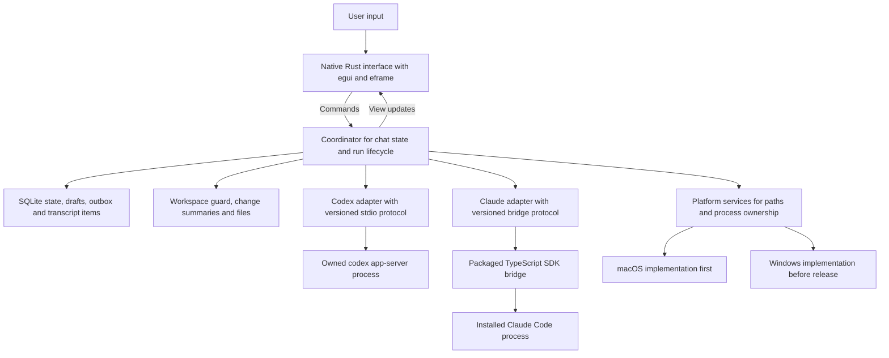
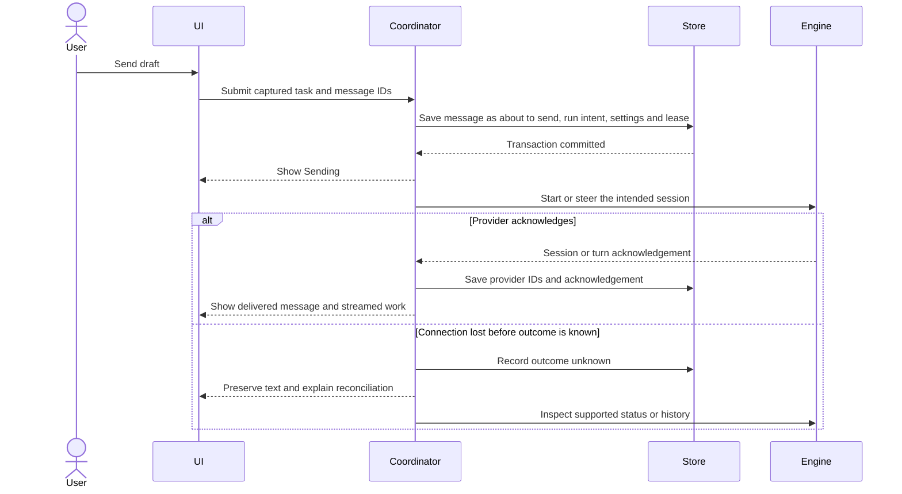

# Bukno first version implementation specification

Written 1 October 2026 for Rasmus and the person implementing Bukno.

Build a native Mac app that Rasmus can use daily for Codex and Claude text work. Keep its interface, state, and provider coordination portable, then finish and test Windows on a Windows machine before public release. The first implementation pass delivers one complete Codex workflow in the real app. Subsequent passes add Claude and finish the daily workspace.

This is an implementation specification, not an implemented application. The repository currently contains planning, research, and approved design assets. No Bukno authentication, provider execution, native UI, or performance result is established by this document.

The Mac-first sequence follows [decision 30](decisions.md). It replaces the earlier requirement to finish both platforms in the first compatibility milestone. Native Rust, installed engines, text first, and Windows before public release remain requirements. Rasmus approved this specification as the build plan on 1 October 2026 ([decision 31](decisions.md)). Stack, defaults, and limits are starting choices with explicit proof gates.

This is the single source for build order, code boundaries, and contracts. Where [first milestone](first-milestone.md), [implementation plan](implementation-plan.md), or [feature map](feature-map.md) disagree with it, this document wins; those keep the checklist, the rationale, and the wider backlog. The design system governs visual values and component behavior. Engine capabilities must come from the installed engine's own interfaces and real verification, not the example content in screenshots.

Each numbered section names the pass where its behavior is first required, as **Lands in**. Content without a later pass is required by Pass 1. Do not build later-pass machinery early; reserve the field or boundary only where this document says so.

Quick navigation: [scope](#1-what-the-first-usable-app-does), [architecture](#2-architecture), [code scaffold](#4-repository-scaffold), [data model](#6-domain-model-and-durable-records), [provider integration](#9-codex-adapter), [interface](#13-interface-implementation), [implementation passes](#19-implementation-passes-and-reviewable-outputs), and [acceptance evidence](#20-end-to-end-verification-and-evidence).

## 1 What the first usable app does

The acceptance story is straightforward: launch Bukno from Finder, open a project or start a projectless chat, choose an available Codex or Claude model, send a request, follow its work, answer any approval or question, inspect changed files, stop when necessary, and resume after quitting. Drafts and output files survive. A lost connection never silently submits the same work twice.

| Delivery | Included | Completion condition |
|---|---|---|
| First implementation pass | Mac app shell, native text controls, durable chat/draft/run state, Codex start/stream/approve/stop/resume, project and projectless workspaces | A packaged development app completes the Codex acceptance flow and retains evidence |
| Mac daily driver | Claude parity for core text work, approved interface, model controls, history, attachments where supported, change summaries, settings, recovery, accessible interaction | Both providers pass the Mac acceptance matrix through the actual app |
| Windows and public release | Native Windows process/platform integration, the same core workflows, installers, signing and clean-machine setup, public authentication requirements | Actual Windows and Mac packages pass their matrices; public login and distribution gates are satisfied |
| Later feature work | Bukno-managed delegation, speech, remote computers, integrated Git workflows | Separate feature specifications and acceptance evidence |

The daily driver includes new, rename, archive, unarchive, and reopen chat; add/remove a project association from navigation; title search; model and supported effort/fast-mode selection; provider-reported activity and To-do; inline Markdown, tables, and code; permission/input cards; external file and browser opening; and cached usage where exposed. Removing a project from navigation never deletes its files. Full transcript search is deferred.

There is no public API service, cloud database, embedded browser, terminal emulator, code editor, automatic commit, or Git undo in this version. No microphone permissions or speech runtime load during text work. The right panel shows the current agent's To-do when supplied. The Delegated work section appears only when there are real tasks supported by the current integration, never illustrative workers.

Provider selection is free until a chat's first submission. After that the provider is fixed for that chat; the other provider remains visible in the picker with the design's handoff explanation. Creating a separate chat is available. Cross-provider handoff is a later feature, not a silent model switch.

## 2 Architecture

**Lands in:** Pass 0 for the boundaries and state machine skeleton; Pass 1 for the full send and recovery flow.

Keep one desktop application with an in-process coordinator. A coordinator is the part that decides which chat receives an event, which task may run, and what must be saved. It owns the lifecycle; the engines own their agent loops and provider conversation history.



All chat behavior passes through the coordinator. Widgets cannot write to a provider, launch processes, query SQLite, or mutate Git. Provider adapters cannot decide which chat is selected or choose an alternative model/provider after an error. Storage cannot start work. This keeps platform changes and UI revisions from altering execution rules.

There are four execution contexts, not four application services:

1. The OS main thread runs the window and native UI. It only reads prepared view state and sends commands.
2. A Tokio runtime runs the coordinator and provider I/O. Begin with two worker threads and measure before increasing the count.
3. A dedicated storage worker serializes SQLite writes and bounded history reads. File hashing and Git work use bounded blocking workers, never the UI thread.
4. Owned provider processes perform agent work. They start on demand and are tracked until their descendants stop.

Use typed channels between these contexts. Token updates may be coalesced for display, but approval, submission, and terminal events must remain ordered and cannot be dropped.

### Coordinator as one state machine

One coordinator task owns all chat, run, delivery, decision, and lease state. Nothing else holds a mutable copy, and there is no shared lock-protected state. It reads one inbox that merges UI commands, adapter events, timers, and storage completions, and handles each input to completion before the next.

The decision logic is a pure function in `crates/core`: given the current state and one input, it returns the new state and a list of effects, such as "persist this", "write this frame to Codex", "publish this view", or "start this timer". It performs no I/O and reads no clock directly. `crates/runtime` executes the effects and feeds their results back into the inbox. All lifecycle, delivery, and recovery rules in sections 8, 11, and 12 live in that function, not in adapters or widgets.

Persistence uses an outbox. Before any frame that starts or steers work is written to an engine, the same SQLite transaction that records the state change also records the delivery as "about to send". The runtime writes to the engine only after that commit. On restart, a delivery still marked "about to send" or "sent, not acknowledged" becomes OutcomeUnknown and is reconciled, never resent automatically. Publish durable UI state only after its transaction commits.

The same function makes failures reproducible: a recorded sequence of inputs can be replayed through the real coordinator and storage to recreate a bug or prove a fix. This is end-to-end coverage of the coordinator through its real boundaries, not a set of isolated unit tests.

## 3 Stack and dependency choices

**Lands in:** Pass 0.

| Area | First choice | Why and proof required |
|---|---|---|
| Native UI | Rust with egui/eframe, wgpu renderer and AccessKit integration | Matches the agreed native direction; prove text selection, IME, accessibility, and design fidelity before expanding |
| Async work | Tokio, with bounded channels | One coordination model for processes, streams, deadlines, and cancellation |
| Persistence | SQLite through rusqlite, with bundled SQLite | Local transactions and migrations without a server; verify the external-drive filesystem and locking behavior |
| Data contracts | serde, serde_json, UUID identifiers | Typed domain data and versioned JSON wire messages |
| Errors and diagnostics | thiserror and tracing | Structured errors and redacted, bounded operational logs |
| Markdown | pulldown-cmark with native block rendering | Parse once, render incrementally, and keep output selectable; no HTML execution |
| Claude bridge | TypeScript, official Agent SDK, Bun compiled executable as the first packaging candidate | Ships its runtime with the bridge; installed Claude Code remains a separate required engine |
| Bridge contract | Message types defined once in Rust; JSON Schema generated with schemars and TypeScript types generated from it | One source of truth instead of hand-kept Rust, TypeScript, and schema copies |
| UI automation | egui_kittest driving the real egui interface through its AccessKit tree, with screenshot snapshots | Repeatable UI evidence from the real widgets; supplements, not replaces, packaged-app checks with VoiceOver |
| Fonts | Bundled official Geist and Geist Mono files with their license | Implement the approved type system without runtime font downloads |
| Build tools | Cargo workspace and a small Rust xtask package | Shared development, packaging, schema, fixture, and evidence commands across platforms |

These choices do not imply that Bun packaging of this SDK or the native UI contract already works. Bun documents standalone compilation and platform targets; the SDK's subprocess and asset behavior still needs a packaged integration test. If that fails, evaluate a Node single executable before changing the provider architecture. Record the selected runtime and rationale after the proof. [Bun executable documentation](https://bun.sh/docs/bundler/executables).

eframe provides a native application entry point. Its accessibility integration does not establish the accessibility of custom Bukno controls. [eframe documentation](https://docs.rs/eframe/latest/eframe/).

Pin the exact Rust toolchain, Cargo dependency resolution, SDK version, Bun version, and schema provenance when scaffolding. Commit Cargo.lock and the bridge lockfile. Select versions from supported releases at implementation time. These pins cover Bukno's own build. They are not a limit on which installed engine versions Bukno runs with; see [section 9a](#9a-engine-versions-and-reverting). No runtime downloads on application launch and no automatic engine upgrades by Bukno.

## 4 Repository scaffold

**Lands in:** Pass 0. Create only the files the current pass needs.

Create the following when implementation begins. This is the proposed layout; these application files do not exist yet.

```text
bukno/
  Cargo.toml                         # workspace and shared dependency versions
  Cargo.lock
  rust-toolchain.toml
  .cargo/config.toml                 # portable aliases, no personal paths
  .github/workflows/check.yml
  apps/desktop/
    Cargo.toml
    src/
      main.rs                        # composition root and window startup
      app.rs                         # UI state and coordinator connection
      theme.rs                       # approved tokens to native styles
      navigation.rs
      screens/{setup,chat,settings}.rs
      components/                    # native equivalents of design components
      transcript/                    # the one custom transcript widget: document, selection, layout, accessibility
      accessibility.rs
  crates/core/                       # pure: no I/O, no clock, no egui
    src/{ids,task,run,message,capability,permission,event,error}.rs
    src/machine.rs                   # the coordinator's state-and-effects function
  crates/runtime/                    # I/O shell that executes effects
    src/{coordinator,commands,session,delivery,recovery,limits}.rs
    src/{workspace,changes,usage,attachments,engines}.rs
  crates/providers/
    src/{lib,contract}.rs
    src/codex/{adapter,protocol,transport,mapping}.rs
    src/claude/{adapter,protocol,transport,mapping}.rs
  crates/storage/
    src/{lib,repository,transcript,migrations}.rs
    migrations/0001_initial.sql
  crates/platform/
    src/{lib,paths,discovery,process,open,notifications}.rs
    src/{macos,windows}/
  bridges/claude/
    package.json
    bun.lock
    tsconfig.json
    src/{main,protocol,session,permissions,events}.ts
  protocol/
    claude-bridge.schema.json        # generated from the Rust bridge types; checked in for review
    codex/<engine-version>/           # schema generated from a tested engine, with provenance
    tested-engines.json              # versions that passed acceptance; informational, never a gate
  assets/{fonts,icons}/
  packaging/{macos,windows}/
  xtask/src/
    {main,dev,doctor,schema,package,e2e,bench}.rs
  e2e/
    scenarios/                       # repeatable user/system workflows
    fixtures/                        # small synthetic inputs only
  docs/
    first-version-specification.md
    design/                          # existing canonical design package
```

Each Rust package also has its own Cargo.toml and library/binary entry point. Start with the files needed for the first flow; do not populate every file with empty abstractions. Components and adapters begin as modules, not separate packages per control or provider. There is no generic plugin framework or dependency-injection container.

Dependency direction is `desktop -> runtime -> providers/storage/platform`, with `core` shared by all. `core` has no I/O dependencies, so the state machine can run unchanged in the app, in replay, and in the E2E harness. Providers may use platform process services. Storage depends on core, never providers. Only desktop imports egui. The bridge is a child executable, not a Rust workspace member; its TypeScript protocol types are generated from Rust by an xtask command. xtask orchestrates development operations and is not shipped as part of the app.

The React preview bundle in docs/design remains reference material. Do not copy it into a runtime frontend or add a JavaScript UI build. Embed the canonical tokens.json at build time, decode it into one Theme, resolve token references, and fail the build if required tokens are missing. Bundle fonts and accessible icon labels. Native shadow rendering may need an approximation, which must be visually reviewed against the reference rather than silently changing the design.

## 5 File placement and application data

**Lands in:** Pass 1 for both locations and the onboarding choice. Pass 3 for drive-loss polish.

Development follows [AGENTS.md](../AGENTS.md): source, scripts, schemas, manifests, lockfiles, and configuration templates stay in this repository; toolchains, compiler output, Bun, package caches, and dependency directories use the internal drive in their normal user-level locations. Recommend `~/Library/Caches/bukno/cargo-target/` for compiler output and `~/Library/Caches/bukno/deps/claude/` for bridge dependencies, using a documented repository node_modules symlink where supported. Keep machine paths in local launch configuration, not committed Cargo settings. Bootstrap must report the locations it uses and reuse installed tools.

The running app keeps two separate locations ([decision 33](decisions.md)):

| Location | Where | What it holds |
|---|---|---|
| App state | The internal drive, in the platform's normal per-user folder: `~/Library/Application Support/Bukno/` on macOS and `%LOCALAPPDATA%\Bukno\` on Windows. Not user-selectable. | Preferences, the SQLite database, migration backups, diagnostics, and engine records. Small, fast, and always present. |
| Work folder | Chosen by the user during onboarding and changeable in settings. Rasmus selects a folder on Toshiba. | Projectless chat folders, attachments, and full tool output. It is also the default location offered when adding or creating a project. |

The app itself, including the packaged Claude bridge, is installed normally (for example `/Applications/Bukno.app`). Do not override HOME, CODEX_HOME, or Claude's credential directory.

```text
<app state>/
  config.toml                        # preferences, including the work folder path; never credentials
  state.sqlite                       # metadata, drafts, delivery outbox, transcript items
  backups/                           # verified pre-migration backups
  diagnostics/                       # redacted logs, rotated by size and age

<work folder>/
  chats/<task-id>/
    workspace/                       # persistent projectless work
    attachments/                     # explicitly imported inputs
    runs/<run-id>/output/            # bounded full tool-output files
```

Project chats point to their selected existing folder, wherever it is. They do not copy the repository into the work folder. Projectless chats each get a stable separate workspace without Git initialization. Attachments belong to a task and are never silently copied between tasks. Generated user output is durable work, not a cache. Changing the work folder in settings applies to new chats; existing chats keep their recorded paths, and Bukno never moves files without an explicit action.

For development and E2E runs only, `BUKNO_STATE_DIR` and `BUKNO_WORK_DIR` point both locations at isolated temporary folders. The synthetic scenario mode always uses them. If either is set on a normal launch, the setup screen shows the override.

Because app state is always on the internal drive, Bukno always opens and the sidebar always renders. If the work folder or a project folder is missing, its chats show the design's Unavailable state and keep their identity; sending to them is disabled with the reason in words. New projectless chats are disabled until the work folder returns or the user picks another. Never create an empty replacement work folder on the internal drive. If a folder disappears during a run, attempt to stop that run, mark its outcome as unknown, and keep the chat. Do not report a draft as saved until the write succeeds.

Keep one application writer per state directory using an OS-backed lock. A second launch focuses the existing process or reports the lock owner; stale ownership needs PID/start-time validation. Use transactional migrations, foreign keys, and a schema version. Back up before migration using SQLite's backup mechanism, not a live file copy. Refuse to mutate a database from a newer unsupported schema. Corruption opens a recovery screen and preserves the original files. Use WAL on the local state directory. The state directory is never placed in a synchronized or network folder.

## 6 Domain model and durable records

**Lands in:** Pass 1 for the nine tables marked Pass 1. Later tables arrive with their feature.

In the product the user sees chats and tasks. Internally a Task is the durable conversation identity, and a Run is one attempt to perform submitted work, normally one provider turn. A chat contains many runs. Streaming, changing selection, or restarting a provider cannot change the identity of the original recipient.

| Record | Essential fields and constraints | Lands in |
|---|---|---|
| Workspace | ID, canonical path, filesystem identity, kind, optional Git root, current writer run and process generation; required even without a project | Pass 1 |
| Project | ID, name, display path, workspace ID, archived flag | Pass 1 |
| Task | ID, optional project ID, reserved parent ID, workspace ID, provider, title, created/updated times, archive state | Pass 1 |
| Provider session | ID, task ID, provider session/thread ID (latest, since resume can issue a new one), engine version and path, resume state, last known provider turn ID; no tokens | Pass 1 |
| Run | ID, task ID, session ID, attempt number, lifecycle state, effective settings snapshot, timestamps, terminal reason | Pass 1 |
| Message delivery | ID, task ID, run ID when known, draft revision, body/input references, outbox state (about to send, sent, acknowledged, rejected, unknown), provider acknowledgement | Pass 1 |
| Draft | Task ID, text, attachment references, revision, last successfully saved time | Pass 1 |
| Pending decision | ID, run ID, connection generation, provider request ID, kind, requested scope, allowed response forms, state | Pass 1 |
| Transcript item | Task ID, run ID, stable item ID, provider item ID, kind, normalized content, completed flag, order key | Pass 1 |
| Attachment | ID, task ID, local reference, MIME type, byte size, checksum, delivery capability | Pass 3 |
| Usage snapshot | Provider/account/bucket identity, window/reset, value/source, fetched time, unknown/stale flags | Pass 3 |
| Result | Run ID, revision, final message reference, output/change/evidence references, parent delivery state | Delegation milestone |

Use separate typed IDs for tasks, runs, messages, requests, and workspaces. Database uniqueness enforces one current delivery record per message ID and one current writer per workspace. Timestamps are UTC; display in the user's locale. Paths retain their platform identity, not a lowercased string or an interpolated shell command. A host ID is not needed in version one; add it with remote computers.

### One transcript store

Bukno shows the conversation from its own transcript items. It saw every event it displays, so these items are the display source for every chat it has run. Provider transcripts remain authoritative for model context only. Bukno never rebuilds model context from its own items.

Provider history is read for exactly two purposes:

1. Reconciliation after a crash, a lost connection, or an OutcomeUnknown delivery: find out which turns actually happened and fill in their final items.
2. Detecting outside continuation. Codex threads and Claude sessions are also visible in their own apps and CLIs. When a chat opens and the engine is available, compare the provider's latest turn ID with the stored one. If they differ, show a short notice that the chat continued outside Bukno, and load the missing turns from the provider before allowing a send.

There is no separate history folder, coverage marker system, or event journal table. Large tool output lives in the work folder and is referenced from its item. Transcript items are private user content, not diagnostics or Git material.

Persist lifecycle transitions transactionally. Do not write every token. Upsert the active item in batches while streaming, and mark it completed on the provider's completion event. Keep one selected transcript window in memory, with a small bounded cache for recent navigation. Never hydrate every sidebar chat. For E2E evidence and bug reports, an explicit recording mode can write the coordinator's input sequence to `events.jsonl` for replay; normal use does not.

## 7 Commands and events

**Lands in:** Pass 1, except LoadHistoryPage paging and OpenFile, which can be basic until Pass 3.

Use a small application command surface: CreateChat, AddProject, SelectChat, SaveDraft, UpdateSettings, SubmitMessage, AnswerDecision, InterruptRun, LoadHistoryPage, ArchiveChat, RefreshEngine, OpenFile, and Quit. Each command returns a local acceptance/rejection result. Acceptance into the coordinator is separate from provider acknowledgement.

SubmitMessage carries a captured task ID, draft revision, message ID, input references, and selected settings. It must not look up the currently selected chat later. AnswerDecision carries the pending decision ID and owning run/connection generation; a stale or mismatched response is rejected.

Adapters implement discovery/connection, capability retrieval, create/resume session, submit, supported steering, answer decision, interrupt, history retrieval, reconcile, and shutdown. Unsupported operations return a typed capability error. Do not require every adapter to simulate every operation.

Normalized events include SessionReady, RunAccepted, TextDelta, ItemCompleted, ActivityChanged, PlanUpdated, DecisionRequested, DecisionResolved, FileChanged, UsageUpdated, RunEnded, and ConnectionLost. Every event has provider, task/run identity where established, connection generation, local arrival sequence, and any provider item/request ID. Preserve provider-specific details alongside the normalized fields.

The view layer receives projections such as ChatSummary, ActiveConversation, PendingDecisionView, and EngineStatus. Those views contain presentation data without raw provider transport objects. Use revisions to ignore late updates after navigation, and stable item IDs to preserve text selection and scroll anchors.

## 8 Sending and recovery

**Lands in:** Pass 1.



Run states are Preparing, Starting, Running, WaitingForApproval, WaitingForInput, Cancelling, Completed, Failed, Interrupted, and OutcomeUnknown. Queued delivery is a message state, not evidence of a running engine. A chat can be idle after a run reaches any terminal state.

| Event | Required transition and user behavior |
|---|---|
| Local validation fails | Keep draft editable; no provider submission and no running state |
| Local send persisted | Show Sending; keep the exact submitted body in durable storage |
| Provider acknowledges | Link provider IDs; clear only the submitted draft revision, preserving anything typed afterward |
| Approval/question arrives | Keep run alive, show the appropriate waiting state, and expose Stop |
| Final provider event arrives | Commit terminal status and result; release lease only when execution is settled |
| Stop selected | Enter Cancelling immediately; acknowledgement alone does not prove descendants have stopped |
| Connection/submission uncertainty | Enter OutcomeUnknown; block automatic resend and competing writes |
| Restart | Reconcile incomplete runs against provider state and process ownership before enabling continuation |

Deduplicate repeated clicks and internal retries by message ID before transport. A provider may lack a durable idempotency key for start/steer; the local outbox does not guarantee exactly-once execution across that boundary. After ambiguous delivery, use supported history/status and known turn IDs to determine what happened. If that is insufficient, preserve OutcomeUnknown and offer an explicit resend with the possibility of duplicate work explained. Never infer success from a matching snippet alone.

Codex may accept mid-run steering. Where a provider cannot safely accept it, save the follow-up as Queued for the next turn. Queued messages are editable/removable until dispatch. They may dispatch after a successful active turn while the app remains open, but pause after cancellation, failure, unknown outcome, or restart. A settings change during work applies to the next turn and is labeled accordingly.

Draft autosave starts at a proposed 250 ms debounce, flushes on navigation/focus loss and orderly quit, and reports save failures. A crash can lose changes inside that debounce window; do not promise keystroke-level durability. Drafts and queued messages remain separate records. Never replay a queue merely because the application relaunched.

## 9 Codex adapter

**Lands in:** Pass 1.

Use a directly owned `codex app-server` stdio child, not the shared daemon. One lazily started process may serve multiple Bukno chats. The connection maintains a request map, independent response and notification handling, and a new generation ID after every restart. Keep stdout exclusively for protocol; consume stderr separately so either pipe cannot deadlock the child.

The documented flow is initialize/initialized, thread/start or thread/resume, then turn/start and streamed events. Relevant operations include turn/steer, turn/interrupt, thread/read, model/list, account/read, and account/rateLimits/read. Approvals and questions are server requests and must receive their version-specific responses. [Codex app-server documentation](https://developers.openai.com/codex/app-server).

Generate Rust wire types only for the methods, notifications, and server requests Bukno uses, from a tested engine's generated JSON schema. Keep them tolerant: accept unknown fields, map unknown enum values to an explicit Other value, and keep the raw JSON alongside the typed value for diagnostics. An xtask command regenerates the schema from any installed engine and reports changes to the methods Bukno uses, so a breaking engine update is found by a check, not by a user.

Before first use, discover the exact executable, read its version, and initialize with Bukno's own name/version. When npm installs Codex behind a JavaScript wrapper, launch the native binary that the wrapper starts where it can be resolved reliably, so no extra Node process sits in the chain. Prefer the stable protocol surface; record each experimental method explicitly if one is necessary. Advertise only request types that the UI can safely answer. Unknown notifications may become a generic event; unknown requests requiring a response must receive a supported rejection/error and a visible explanation, never an invented approval.

Retrieve the account and available models without an inference probe on every launch. Preserve both requested and effective model/settings. A visible account or model list means Ready to try, not authenticated work verified. Mark the provider usable after a real completed task during acceptance. Reuse engine-managed CLI login and refresh; do not read or copy its credential file or introduce API billing as a fallback.

Use the expected active turn ID when steering. A steering race with completion becomes a queued follow-up only after rejection is known; an ambiguous acknowledgement follows the unknown-outcome path. Interrupt targets the specific active turn. Process termination is escalation, not the normal Stop implementation.

Shared-process failure affects every loaded Codex session. Before restarting it, mark all affected active runs unknown and retain their leases pending reconciliation. Do not restart a healthy shared process to clear a single UI error. Unsubscribe/unload inactive sessions where the tested engine supports it; opening old history does not require starting an agent turn.

Version handling for Codex follows [section 9a](#9a-engine-versions-and-reverting).

## 9a Engine versions and reverting

**Lands in:** Pass 1 for Codex, Pass 2 for Claude. Settings polish in Pass 3.

Bukno works with whatever engine version is installed ([decision 32](decisions.md)). There is no supported-version range and no "Unsupported version" block. Engines update often: on this Mac, Claude Code went from 2.1.263 on 6 September to 2.1.283 on 27 September. A daily driver that refuses each new release would be broken most days.

How Bukno stays working across versions:

- Protocol handling is tolerant, as described for Codex in section 9 and the bridge in section 10. Unknown notifications become generic activity. Unknown server requests that need an answer get a supported rejection and a visible explanation, never an invented approval.
- Capabilities come from what the running engine reports, such as its initialize response, model list, and schema, not from a lookup by version number.
- Bukno reads the engine version every time it starts an engine process, not only at app launch, because engines update while Bukno is running.
- `protocol/tested-engines.json` lists versions that passed the acceptance flow. Settings show "Tested with Bukno" or "Not yet tested with Bukno". This is information, never a gate.

**Last working version.** After every run that completes normally, Bukno records that engine's version, exact executable path, and file hash as its last working version. One record per engine.

**When a new version breaks.** A failed handshake, protocol errors on methods Bukno uses, an engine that exits at startup, or repeated adapter errors on a version newer than the last working one show this on the engine card and in the affected chat: "Codex 0.160.0 is not working with Bukno. The last working version is 0.159.2." Actions: **Use 0.159.2**, **Check again**, and **Show details**. Settings also offer **Use previous version** at any time, for problems Bukno cannot detect itself.

**How Bukno reverts**, in this order:

1. If the previous binary is still on disk, point Bukno at that exact file. Claude Code's native installer keeps earlier versions (in `~/.local/share/claude/versions/` on this Mac). Nothing is installed or deleted.
2. Otherwise, run the engine's own official install command for that exact version, such as `claude install 2.1.281` or `npm install -g @openai/codex@0.159.2`. Show the command first and run it only when the user clicks. Say so when it also changes the version the user's terminal uses.
3. If neither route is available, show the command to run manually.

After a revert, Bukno stays pinned to that executable until the user chooses **Try latest version**. An engine update outside Bukno does not move Bukno forward silently. Show the pin on the engine card and in settings. Bukno never upgrades or downgrades an engine without a click, never copies credentials, and does not keep its own copies of engine binaries. Verify the exact revert route for each install method (Claude native installer, npm, Homebrew, and the Windows installers) in the pass that adds that provider or platform.

The Claude bridge pins its SDK version. A newer installed Claude Code can still change what the SDK expects. Handle that the same way: a tolerant bridge, the last working CLI, and revert. A Bukno release updates the bridge's SDK. Saved chats stay readable whatever the engine state, because they are displayed from Bukno's own transcript items.

## 10 Claude adapter and bridge

**Lands in:** Pass 2.

Rust speaks a Bukno-owned protocol to a small packaged TypeScript bridge. The bridge uses the official Agent SDK and explicitly selects the user's installed Claude Code executable. It never silently chooses an SDK-bundled engine instead. Pin and inspect the SDK's executable, resume, stream, permission, model, and session-history interfaces during the Claude pass.

Start one bridge process for all Claude chats, lazily, the same way one app-server serves all Codex chats. Each SDK session already runs its own Claude Code process, so the heavy part of a failure stays scoped to one chat; a bridge per chat would add a JavaScript runtime per active chat against the memory budget. Inside the bridge, each session owns one live SDK conversation, accepts input while reading events, and never reopens a CLI process per streamed chunk. One stalled or failed session must not block another session's events, Stop, or Deny. A bridge crash affects every loaded Claude session and follows the same rule as a Codex process failure: mark active runs unknown, keep their leases, then reconcile. Measure memory and failure behavior in Pass 2; fall back to one bridge per chat only if the shared process cannot isolate sessions well enough.

Use SDK session identifiers for continuation and preserve them as soon as reported. Session resumption restores provider context; it is not the same as importing a rendered transcript. Verify successful continuation after closing and recreating the bridge, including a projectless workspace. [Claude session documentation](https://code.claude.com/docs/en/agent-sdk/sessions).

Prefer the SDK's streaming input flow for ongoing conversations and interactive control. Only expose immediate steering after proving its actual delivery semantics; otherwise use the visible next-turn queue. [Claude streaming input documentation](https://code.claude.com/docs/en/agent-sdk/streaming-vs-single-mode).

The proposed bridge protocol is newline-delimited JSON with `protocolVersion`, `id` or `replyTo`, `sessionHandle`, `runId`, `kind`, and typed `payload`. A hello exchange returns bridge build, SDK version, chosen CLI path/version, supported operations, and size limits. Commands cover open/resume, submit, answer, interrupt, history, and close. Events cover the normalized content and lifecycle contract. All other output goes to stderr.

Define the bridge messages once as Rust types. Generate the checked-in JSON Schema with schemars and the bridge's TypeScript types from that schema, through an xtask command; validate messages at the process boundary. The bridge ships inside the app, so a protocol version mismatch between Bukno and its own bridge is a packaging error and stops startup. Carry original SDK request IDs internally, and expire callbacks when their run/connection ends. Keep the input reader responsive while a permission callback waits. A full output queue must not prevent Stop or Deny from being read.

Load user, project, and local settings explicitly for the selected working directory, and report the effective source set. Do not rely on SDK defaults remaining unchanged. Provider-managed policy and additional configuration sources may still apply; `settingSources` is not a complete isolation boundary. Verify CLAUDE.md, a harmless skill, and one configured MCP tool in the packaged flow. [Claude configuration documentation](https://code.claude.com/docs/en/agent-sdk/claude-code-features).

The default authentication route is the user's existing Claude Code login. If an inherited API-key or alternative-provider setting changes billing, require explicit selection of that route in setup rather than silently using it. Do not display subscription quota from token totals or estimated API cost. When no supported source exposes account limits, show Usage unavailable.

An initial idle policy may close a Claude session 120 seconds after its task becomes inactive, with no queued work or pending decisions, and the bridge itself once no session is open. Enable this only after resume is verified. Measure relaunch latency and total retained memory; change the delay based on those results. Bundle the bridge executable and required non-engine assets in the app package, and verify launch without Node or Bun installed on the destination machine.

## 11 Permissions and user questions

**Lands in:** Pass 1 for Codex presets and decision cards; Pass 2 for Claude.

Permission presentation must describe the actual engine protection. Approval prompts, OS sandboxing, configured tool permissions, and workspace ownership are different controls. A selected directory or a Bukno lease is not a sandbox.

There are no shared cross-provider permission levels. Each adapter publishes its own list of presets, built from what its engine actually enforces: Codex combines a sandbox mode with an approval policy, and Claude combines a permission mode with tool rules and has no OS sandbox. The PermissionControl shows the selected provider's list. Each preset carries:

| Field | Meaning |
|---|---|
| ID and label | Stable ID and honest short label, such as "Read only, Codex sandbox" or "Ask before edits" |
| Description | One sentence on what is allowed and what asks first |
| Protection | What enforces it, in the design's words: "Runs in the Codex sandbox" or "Approvals only, no OS sandbox" |
| Writes | Whether the preset can change files: never, after approval, or freely. Section 12 uses this for the writer lock |
| Engine settings | The exact provider settings the adapter applies |

A preset is offered only after its behavior is proven on that provider; an unproven preset stays hidden, not relabeled. A label never claims "read only" while writable shell or MCP routes remain open. Relaxed presets are explicit user choices within the provider's scope, never a default and never a bypass of managed restrictions. Default to the most conservative usable preset and show the effective preset before the first send.

Per-request answers are separate from presets. **Allow once** resolves this exact request only. **Allow for this chat** is offered only when the engine can represent that scope and Bukno can expire it correctly; never rewrite a global config file to simulate it.

For Claude, `canUseTool` handles permission decisions that reach it, but auto-approved tools can bypass that callback. Checks that must see every tool call require the supported hook path as well as carefully configured permissions. Permissions remain distinct from OS isolation. This is a proof requirement for the first policy implementation. [Claude permission documentation](https://code.claude.com/docs/en/agent-sdk/permissions).

Show the real command or requested file action, working directory, reason when provided, scope, and allowed decisions. Handle network grants and MCP requests as their own request kinds instead of disguising them as shell commands. An unrenderable request can be declined or stopped with an explanation. Unsupported external-auth elicitation must not leave a permanently blocked run.

Pending cards are docked above the composer. Keyboard shortcuts act only when the card has deliberate focus; the Enter key that sent a message must not approve a newly arriving command. Esc closes a menu first and denies only when focus is on the decision card. After answering, show Sending decision until acknowledged, and avoid resending an ambiguous approval as if it were new.

Questions use the provider's supported choices, free text, and cancellation behavior. Never convert a timed-out question into permission. Multiple pending decisions are separately addressable and ordered visibly. A question waits without occupying the main UI thread. The SDK supports interactive approvals and questions through its documented callback flow. [Claude user input documentation](https://code.claude.com/docs/en/agent-sdk/user-input).

At cancellation, process loss, or terminal completion, invalidate all outstanding decisions for that run. Store the resolved/expired state. An old button cannot approve a later run even if a provider reuses a numeric request ID.

## 12 Workspace ownership and changes

**Lands in:** Pass 1 for the writer lease; Pass 3 for the change strip and Git summaries.

A run whose preset can write files takes the workspace's writer lease before provider submission. A run whose preset can never write, as published by the adapter in section 11, takes no lease, so you can ask about a repository while another chat edits it. Resolve symlinks and filesystem identity, normalize Git work to its actual checkout root, and treat overlapping non-Git folders as the same workspace. Two chat IDs pointing at the same folder must not bypass the guard.

When a second writing run targets a held workspace, do not hard-block. Show who holds it ("Codex is changing files in this project in Polish the composer") and offer **Queue** (the default, runs when the lease frees) or **Run anyway**. Run anyway records an explicit shared lease on both runs, labels both chats, and marks their change summaries as possibly mixed. The guard cannot stop editors or outside agents, so it informs and orders Bukno's own work rather than claiming exclusive control.

The first version defaults to two active top-level runs in total, configurable in settings. Further submissions wait in a visible queue.

A lease is held through approval waiting and ambiguous execution. Release it only after the run and relevant owned tool activity are settled. Restart cannot erase an uncertain lease. This protects Bukno's own work; editors and unrelated agents can still change files, so the UI must not claim exclusive system-wide control.

Native provider children inherit their parent's task ownership. Do not map them into duplicate Bukno workers. Account for descendants in cleanup and memory measurements; if their lifecycle is not observable, do not promise a complete worker cap or editable cross-provider concurrency.

Use the installed Git executable via argument arrays and machine-readable output. Read branch/status and capture a pre-run inventory of existing dirty files. Refresh changes after meaningful file events, completion, or user expansion, with debounce. Do not run Git on every token.

The change strip is labeled Workspace changes. It includes staged/unstaged and untracked status as available. Binary files, renames, deletions, and unknown line counts must have distinct representation. Existing changes must remain visible as pre-existing, and provider-reported touched files are a separate attribution hint. Do not call a whole checkout diff the agent's own patch.

For non-Git workspaces, show files reported by reliable provider events and omit unverified totals. Opening a file is read-only from Bukno's perspective. Version one provides no reset, revert, checkout, staging, automatic merge, or deletion operation. Final disposable-fixture diffs belong in acceptance evidence, not an embedded review editor.

## 13 Interface implementation

**Lands in:** Pass 0 for the theme, shell, and transcript widget; other screens as listed under Design coverage.

Build from [system rules](design/system/README.md), [tokens](design/system/tokens.json), component contracts, and the journey images. The approved geometry uses a 264-point sidebar, 336-point optional right panel, a transcript/composer column up to 760 points, and a 12-point bottom inset. Points are logical units. Collapse the right panel first and the sidebar second when the minimum readable conversation width would otherwise be lost.

Implement the native components in this order:

1. Theme, typography, icons, buttons, rows, focus, notices, and basic setup cards.
2. Composer, selectable user/agent messages, code blocks, approval/question card, and activity line.
3. Sidebar/projects, settings, model picker and effort slider, usage, change strip, and To-do.
4. Measured motion, responsive panels, remaining accessibility details, and external opening polish.

The native shell in the first pass already uses the real colors, fonts, spacing, and control shapes. Detailed motion can follow, but keyboard usability and selection cannot. Keep one working indicator at the transcript end. The To-do belongs in the right panel and is built from explicit provider plan/task events. Do not parse ordinary prose into an invented plan or progress percentage.

### Interaction rules

| Interaction | Behavior |
|---|---|
| Enter in composer | Send, except during IME composition or when a focused control handles it |
| Shift+Enter | Insert a newline |
| Cmd+Enter on Mac or Ctrl+Enter on Windows | Explicit send shortcut |
| Cmd/Ctrl+N | New chat; preserve the previous draft |
| Cmd/Ctrl+K | Find chats/projects by title and switch; no full-content search claim |
| Cmd/Ctrl+, | Settings |
| Stop | Immediate Cancelling state; available while a follow-up is being typed |
| Switch chat | Preserve draft, pending sends, selection where feasible, scroll anchor, and settings per task |
| Stream while scrolled up | Keep the viewport anchored; show a New output control |
| Stream at bottom | Follow new output without layout jumps or stealing text selection |
| Open model picker | Effort view first, model row to grouped model catalog; unsupported settings explain why |
| Change effort/model during work | Save for the next turn; preserve the effective settings of the current run |

Render Markdown as native text, headings, lists, tables, links, and code. Do not execute HTML or fetch remote images automatically from model output. Long lines in code use contained horizontal scrolling; tables cannot widen the entire app.

### The transcript widget

The transcript is one custom widget, not a stack of egui labels. It is the part most likely to decide whether egui is kept, so Pass 0 builds it first with synthetic data. Selecting across messages, long scrolling history, and screen-reader access must all work in the same view. egui's built-in selection covers labels laid out on screen, not content scrolled out of view, so the widget needs its own model whichever toolkit is chosen.

It has three parts, all in `apps/desktop/src/transcript/`:

1. **Document.** An ordered list of blocks with stable IDs and a revision each, built from transcript items. Completed blocks are parsed once and shared; only the active streaming block changes.
2. **Selection.** Anchor and focus positions expressed as block ID plus text offset, independent of what is laid out. A selection can start in one message, cross code blocks, and end in a block that is currently offscreen.
3. **Layout and accessibility.** Measured block heights, laid-out text cached by block ID, revision, width, and font settings, and hit-testing for the visible window only. The same layout feeds the AccessKit tree with message boundaries and readable text.

Copy behavior: a text selection copies the plain rendered text, with code blocks copied exactly as their content. Each message also has **Copy message**, which copies its Markdown source, and each code block has **Copy code**.

Pass 0 pass criteria: with output streaming into the active block, select from the middle of message 3 to the middle of message 40, scroll away and back without losing the selection, copy, and paste the exact expected text. Do the same with the keyboard only. VoiceOver must read message boundaries and the selected text. Scrolling a 2,000-message synthetic chat stays within the frame target in section 21.

Virtualize using stable block IDs and measured heights, and invalidate widths and fonts deliberately on resize. Pages of history load from Bukno's transcript items around the viewport. A chat continued outside Bukno shows the notice from section 6 until its missing turns are loaded; do not parse private provider databases as a shortcut.

### Motion cost

In egui, any animation redraws the whole window each frame. Run the ThinkingOrb and the other loops at a capped rate, starting at 20 frames per second through scheduled repaints, and measure whether lower still looks right. Streaming text repaints at the token batching interval, not continuously. On reduced motion, replace every loop with the same static status and words. Hidden or minimized windows stop animation repaint requests. Activity text comes from real engine events; no invented thinking text. Accessibility exposes roles, names, focus, text entry, menus, current effort values, and approval actions. Screen readers should receive meaningful message/status boundaries, not an announcement per token.

### Design coverage

| Reference screens | Implementation point |
|---|---|
| 1.1 setup and 1.2 projectless chat | First pass, expanded for Claude in pass two |
| 1.3 effort picker and 1.4 model list | Pass 1 shows the selected model and effort from the engine; full picker with capability-backed behavior in Pass 3 |
| 2.1 work and 2.2 approval | First pass without invented delegated workers |
| 2.3 mid-run direction | Codex steering and explicit Claude queue/capability handling |
| 3.1 to 3.3 delegation | Later milestone; retain design and model foundations now |
| 4.1 changes and 4.2 profile/usage | Daily-driver completion |
| 4.3 Windows connection loss | Recovery logic on Mac first, actual Windows shell in Windows phase |
| 5.1 narrow window and sidebar part | Native shell and daily-driver visual acceptance |

## 14 Attachments and external opening

**Lands in:** Pass 3.

Support explicit file selection, file drop, and supported image paste. Distinguish a workspace file reference from an imported copy. Show filename, size, delivery mode, and remove action before sending. Detect a changed referenced file at submission and ask whether to use the current contents or reselect, rather than silently claiming an earlier snapshot was sent.

Set attachment limits to the smaller of provider limits and a proposed Bukno cap of 20 MiB per file, five files, and 50 MiB total per message. These are starting product limits, not provider guarantees. Validate actual type and file existence, limit decoded image dimensions, and reject unsupported content with an explanation. A PDF is not automatically text or vision input; it may be an explicit local file reference only where the engine can read it. Do not fabricate a successful upload from a copied path.

Prefer supported local file references through the provider/bridge transport. Where inline encoding is required, include its encoded size in the wire-frame limit before accepting the attachment. The file-size cap does not override transport bounds.

Copy imported attachments into the task's storage using atomic writes and generated safe names. Keep the original display filename separately. Never follow an archive's paths into arbitrary directories or fetch a remote URL merely because it appears in the draft. Preserve attachment references in queued and sent messages through restart.

Open file links through the platform layer with exact paths and optional line numbers when the selected editor supports them. Browser links open by user action in the configured browser, defaulting to the OS browser. Reject executable/custom schemes without an explicit supported handler. A preview URL can only be labeled ready after a response check; do not open tabs repeatedly as output streams.

The first version need not create a general preview server. If a supported preview needs a Bukno-owned server, bind it locally, expose only its intended directory, track its process as owned, and stop it on quit. Launching generated content in a browser remains explicit. Include preview-server memory in measurements and report external browser memory separately.

## 15 Engine setup and usage

**Lands in:** Pass 1 for setup and discovery; Pass 3 for usage.

First launch asks where to keep the work folder (section 5), then shows discovered engine paths, version and "Tested with Bukno" status, login status where available, and Check again. The work folder step suggests a sensible default and never assumes an external drive. Codex or Claude may be unavailable while the other works. Do not block all of Bukno because the unused engine is missing. Provide official installation/login guidance and a manual executable picker; do not silently install engines, request credentials in a Bukno form, or scrape browser sessions.

Resolve executable paths from a pinned last working version (section 9a), a user override, platform-known user installation locations, and the inherited environment, in that order. Finder launch cannot assume an interactive shell's PATH. Avoid sourcing arbitrary shell startup files to discover a binary. Record canonical path, version, architecture, and last successful handshake in diagnostics without secret-bearing environment values.

Effective configuration is a snapshot of provider-enforced policy, engine settings loaded for that workspace, and accepted Bukno per-chat/run overrides. Managed policy cannot be weakened by Bukno. Show configuration errors and applied capabilities, but do not promise identical precedence or feature support across providers. Preserve AGENTS.md/CLAUDE.md and provider-native skills/MCP loading; never rewrite global settings to force parity.

Capabilities are detected from the running engine and recorded per engine version, account route where relevant, model, and feature: supported, unavailable, experimental, or unverified. Include text, tools, approvals, questions, resume/history, steering, effort, fast mode, images, usage, plan events, and native children. The UI only offers a control whose operation can be represented and applied correctly. Unverified capability is not enabled merely because a screenshot includes it.

Usage is shared per provider/account/bucket. Read when an engine is already available, apply update events, and coalesce user refreshes. A visible cache older than five minutes may trigger one refresh with backoff. Idle or hidden windows do not poll and do not wake a stopped engine just for a usage bar. Display window labels, reset time, source, and last update. Missing means unavailable. A supplied used percentage can be converted to remaining percentage; do not combine daily and weekly windows into one invented total.

## 16 Process lifecycle and platform boundaries

**Lands in:** Pass 1 on Mac; Pass 4 on Windows.

Use typed argument vectors and platform paths for executable invocation. No shell interpolation for chat text, filenames, credentials, or editor arguments. The process owner records executable identity, PID, start time, parent/ownership generation, and relevant descendants. Never stop processes by a broad name match such as all Claude or Codex processes.

Normal Stop first uses the provider interrupt mechanism. A proposed five-second grace period then exposes that stopping is taking longer. Escalation may terminate the owned process family after clearly reporting its impact, including other chats in a shared Codex process. Mark unconfirmed outcomes unknown. Force-stopping a process does not undo file edits or prove that detached tool activity stopped.

On Mac, use an owned process group and tracked descendants. A process group alone cannot account for children that deliberately detach; verification must check for these and report any unresolved owned task. On Windows, use a job object and appropriate handle inheritance/lifetime management where supported. Verify cancellation with real engine/tool children on each OS; dropping a child handle is not a cleanup strategy.

If Bukno itself crashes, its engines must not keep working unseen. Keep each engine's stdin pipe owned by Bukno so the engine sees end of input and exits when Bukno dies, and verify this for app-server, the bridge, and Claude Code. A panic handler stops owned process groups where it still can. On the next launch, the process records and the outbox drive the normal reconciliation.

Closing the last window invokes the quit flow in version one. With active work, offer Keep working or Stop and quit. An orderly quit stops new submissions, saves drafts, cancels owned work, closes provider connections, verifies process cleanup, checkpoints the store, and then exits. Hiding/minimizing the app leaves the visible running-app lifecycle intact but suppresses animations. There is no detached background runner.

| Shared behavior | Platform-specific implementation |
|---|---|
| Start/stop processes | Mac process groups; Windows jobs and executable/shell rules |
| Workspace identity | Filesystem IDs, case behavior, symlink resolution, drive availability |
| Application startup | Finder/Dock and app bundle; Explorer/Start menu and installed executable |
| Window controls | Native Mac traffic lights; native Windows caption controls |
| Input/accessibility | Clipboard, IME, VoiceOver/AccessKit; clipboard, IME, Narrator/AccessKit |
| External opening | Finder/editor/browser and notification APIs on each platform |
| Sleep and wake | Detect resumed/disconnected provider transport and reconcile, never resend blindly |

Target Apple Silicon first. Use the current development Mac for initial proof; set and test an explicit minimum macOS version before claiming broader compatibility. Windows 11 x64 with native engines is the recommended second target. Intel Mac, Windows ARM64, WSL, and Linux remain separate support decisions. No speculative Windows implementation may silently succeed through a stub: unimplemented operations must return a clear unavailable result.

## 17 Resource limits and diagnostics

**Lands in:** Pass 1 for wire, queue, and output bounds; Pass 3 for the rest.

The purpose of bounds is predictable behavior under long output, not arbitrary truncation of the user's work. Start with these explicit limits, then measure and record any change in this document.

| Resource | Proposed initial bound and overflow behavior |
|---|---|
| Active top-level runs | Two in total, configurable; writing runs also follow the lease rules in section 12; additional submissions remain visibly queued |
| Provider wire frame | 8 MiB; oversized frames produce a protocol error and reconciliation, never partial JSON execution |
| Pending ordinary RPCs | 64 per connection; lifecycle control has reserved capacity |
| UI event buffer | 1,024 entries and 8 MiB; coalesce display deltas, retain durable control events through the store |
| Tool output in a visible item | 64 KiB preview with explicit truncation label and a file action |
| Spool for one tool item | 16 MiB before marking further capture truncated; keep draining the pipe and retain final status |
| Transcript memory | Target 20 MiB of text/layout cache for the selected and recent chats; page older content |
| Diagnostics | 20 MiB total, at most seven days; rotate logs, not user outputs |
| Ordinary control timeout | 30 seconds, with startup capped separately; timeout does not mean a submitted task failed |

Approval waiting and active inference have no generic 30-second cancellation timer. Capacity limits must bound memory and bytes, not just message counts. History queries ask for pages where supported; if a provider only returns oversized full history, report incomplete history or use a separately bounded adapter path rather than raising all memory limits.

Store operational IDs, timings, version details, and sanitized error categories by default. Do not log prompts, transcript bodies, credentials, full environments, or approval payloads into diagnostics. A diagnostic export is explicit and reviewable. Synthetic E2E data may include full events for verification, but private session content stays out of Git and release artifacts. No analytics backend is part of version one.

## 18 Failure paths to enumerate before adapter implementation

**Lands in:** Before each adapter is written: Codex rows before Pass 1, Claude rows before Pass 2.

Use this list before writing adapters or any isolated protocol tests. Add discovered failures to the same list so each test has a specific behavior to prove. Do not add unit tests as a routine implementation follow-up.

| Failure | Required behavior and proof |
|---|---|
| Missing engine, runtime, or bridge asset | Setup names the missing dependency; other provider remains usable |
| New engine version breaks the protocol | Not-working state naming the last working version, with revert (section 9a); saved chats remain readable |
| Engine updated while Bukno runs | New version detected at the next process start; running sessions are not restarted to pick it up |
| Revert fails or old version is gone | Show the manual command; keep the pin unchanged and the other provider usable |
| Missing/expired login or changed account | Show login/account state; retain draft and provider identity; no billing fallback |
| Invalid or unavailable model/effort | Explain rejected setting; do not substitute a model silently |
| Unknown/malformed/oversized protocol message | Bounded error handling; no UI crash or unintended response |
| Full queues or huge output | Input/Stop remain responsive; truncation is labeled; no lost terminal state |
| Duplicate send or late navigation | Exactly one local message; recipient stays the captured task |
| Disconnect before/after acknowledgement | Reconcile; unknown stays unknown until evidence resolves it |
| Engine/bridge crash | Stop activity animation, preserve content, expire decisions, inspect descendants |
| Stale/double approval or question response | Reject stale scope; no effect on a newer run |
| Stop races with completion or steering | One settled outcome; no automatic restart or queued follow-up surprise |
| Resume history missing, incompatible, or incomplete | Preserve task and files; explain missing context; explicit new continuation only |
| Two writers, nested paths, or symlink alias | Detected as one workspace; Queue by default, Run anyway only by explicit choice and labeled |
| External dirty edit or Git error | Preserve unrelated changes and label unknown change counts |
| Missing work folder or project drive | App opens; affected chats show Unavailable and keep identity; no replacement folder created |
| Full or read-only state disk, or SQLite failure | Stop unsafe dispatch; preserve recoverable data and report unsaved state |
| Bukno crashes during a run | Engines exit on end of input; next launch reconciles from the outbox and process records |
| Quit, sleep/wake, or restarted app | Reconcile active runs and processes; no automatic replay |
| Unsupported approval/MCP request | Supported rejection or clear Stop path; no hanging invisible request |

For a failure that cannot be reproduced reliably with a live provider, use a small protocol-peer process through the real transport to inject it. Enumerate its failure case first, assert the end-to-end coordinator/UI result, and label it Simulated protocol coverage. This supplements authenticated evidence; it never replaces it.

## 19 Implementation passes and reviewable outputs

Each pass ends with a usable artifact and an evidence record. The sequence is based on dependencies and integration risk, not a claim about a delivery date. Avoid estimating calendar time until the native UI and both provider proofs establish the actual work.

### Who builds and who reviews

Agreed in [decision 34](decisions.md):

- **Claude builds the foundation.** Claude does the initial scaffolding and interface setup: Pass 0 in full (workspace, crates, xtask, token loader, theme, the transcript widget, the Mac shell, and the UI automation setup), plus the native component set the later passes build on.
- **Sol reviews.** Sol (gpt-5.6-sol through Codex) then reviews the work at each pass boundary: whether the code follows the boundaries in sections 2 and 4, whether the coordinator rules in sections 8, 11, and 12 hold, and whether the evidence actually proves the pass. Sol also reviews this specification when it changes materially.
- **Rasmus decides** who implements each later pass and accepts each pass from its evidence.

Fix review findings before the next pass starts, or record why one is deferred. Keep review notes with the pass evidence, not in this document.

### Pass 0 Foundation and native UI gate

Create the workspace, dependency placement, developer commands, design-token loader, core types, the coordinator state machine skeleton, and the Mac window. Add a synthetic scenario mode that uses isolated temporary state and work folders for visual and input checks; label it clearly and keep it from connecting to real engines. Build the transcript widget from section 13 first and run its pass criteria, then exercise long code, IME, Swedish text, keyboard navigation, VoiceOver, and narrow-window layout before building a large component library. Set up egui_kittest so these checks produce repeatable screenshots and accessibility results.

Time-box toolkit investigation to two focused implementation days. A must-have failure triggers a small comparison with the next native candidate, initially GPUI, before expanding the UI. Do not spend the rest of the project patching around broken text input or accessibility. The candidate itself needs current platform verification; it is not a guaranteed fallback.

Add Mac and Windows compilation checks at this point. Run an early actual Windows UI smoke check for typing, selection, scaling, and Narrator when a Windows machine is available. This is a foundation risk check, not the full Windows integration milestone and not evidence that Windows providers work. Record Windows UI support as unverified until that check runs; do it before investing in the full component set.

Output: packaged Mac shell, screenshots at reference sizes, input/accessibility recording, idle resource baseline, lockfiles, and a written toolkit decision. This is scaffolding only and does not complete the first implementation pass.

### Pass 1 Complete Codex flow on Mac

Implement the nine Pass 1 tables from section 6 and their repositories, stable workspace/task identity, drafts, the delivery outbox, transcript items, the writer lease, the owned process supervisor, and the tolerant Codex adapter with its last working version record and revert. Connect these to the actual native composer and transcript. Add onboarding with the work folder choice, setup states, an approval/question card, Stop, an honest activity indicator, basic history, and restart/resume. The model and effort are shown as the engine reports them; the full picker waits for Pass 3.

Use existing CLI login. Complete a small task in a disposable Git repository and a projectless folder. Verify one declined action, an allowed action, cancellation, a saved draft, session resumption, and preserved unrelated edits. An engine-start command or terminal-only script is insufficient: exercise the user-visible app.

Output: a launchable Bukno.app from Finder plus the Codex E2E evidence package. This is the first implementation pass requested here. Do not stop at a static mockup, green compilation, or a CLI adapter demo.

### Pass 2 Claude on Mac

Build and package the bridge, enforce the versioned transport, explicitly select installed Claude Code, and implement the same lifecycle and interaction boundaries. Verify configuration loading, approvals, questions, cancellation, process cleanup, session history, and projectless continuation. Test the packaged bridge without a developer Node/Bun installation in its runtime environment.

Output: the same app completes both providers' core workflows, with a capability comparison showing where Claude differs. Decide the bridge packaging/runtime based on observed results and record its memory cost.

### Pass 3 Mac daily driver

Finish the approved navigation and component set, title search, archive/unarchive, capability-backed model controls, attachments, To-do, change summaries, settings/usage, native menus, notifications, and external file/browser opening. Notifications occur only for completion, failure, or needed user input when the chat is not in view, and avoid private prompt text by default.

Complete storage migration/recovery, engine-loss and drive-loss behavior, bounded output, process cleanup, keyboard shortcuts, accessible focus, and measured motion. Review actual native screenshots at 1440 by 900 and 1024 by 720 logical size against the design references. Account for native titlebar differences. Record deliberate deviations and fix material discrepancies.

Output: Mac daily-driver candidate and a complete Mac acceptance report. Daily use can begin here while Windows remains explicitly pending.

### Pass 4 Windows implementation and parity

Build and debug on a real Windows 11 x64 machine. Implement process jobs, engine discovery from Explorer launch, shell requirements, paths/Unicode/drive handling, native dialogs/opening, caption controls, notifications, and power transitions. Package the bridge for Windows and verify its runtime assets. Repeat the complete provider matrix, plus Windows-specific sandbox/permission behavior and 100%, 150%, and 200% scaling.

Output: Windows package with retained native-platform evidence and fixes integrated into the shared code. Cross-compilation and a CI build alone do not complete this pass. A later request to work on the Windows machine must follow the repository's fleet handoff instructions; this specification starts no remote work.

### Pass 5 Public distribution

Finish Mac signing/notarization and Windows installer/signing decisions, dependency notices, bundled font licenses, provider-mark permissions, version manifest, install/uninstall behavior, and clean-user setup. Application removal must preserve user work unless the user explicitly chooses data removal. An update cannot mutate a database it cannot understand. Offer a manual package update for the first release; a silent self-updater is not required.

Bukno's own Sign in with ChatGPT remains a separate public-release gate under the existing decisions. Verify current registration, permitted distribution, renewal, logout, and successful inference at that time. Do not infer public client eligibility from the existing CLI login. If this gate is not satisfied, label the build a developer/daily-driver preview rather than claiming the agreed public release is complete.

Output: clean-machine installation evidence for both platforms, release notes with tested engine versions and supported architectures, and a release checklist with no unresolved blocking core flows.

## 20 End-to-end verification and evidence

Use a synthetic fixture named with spaces and Swedish characters, containing a small source project, an existing unrelated dirty file, a binary file, and deterministic instructions. Record its starting tree and checksum. Have each engine create or change a specified file whose contents can be checked independently, and ask a follow-up that requires its earlier session context.

The main acceptance runner drives the same command boundary as the desktop and captures system results. egui_kittest scenarios drive the real interface through its accessibility tree and save screenshots for repeatable UI evidence. A recorded procedure in the packaged app must additionally prove what kittest cannot: Finder launch, VoiceOver, IME, native menus, and platform behavior. Do not call a command-line harness an end-to-end UI test. Provider-free replay scenarios belong to CI; real authenticated runs use the user's intended engine login with explicit normal test execution, never secrets committed to CI.

| ID | Scenario | Pass evidence |
|---|---|---|
| E01 | Finder/Explorer launch and first setup | Work folder choice saved, exact app/engine paths and versions, missing-engine screen, no terminal-environment dependency |
| E02 | Project task and streamed work | Native recording, final expected file content, provider terminal event, final diff, unchanged dirty-file hash |
| E03 | Projectless work | Two chats with different folders; output, drafts, and session links survive quit/relaunch |
| E04 | Permissions and questions | Allowed/declined actions match actual files/processes; answered question continues correct run; stale answer is rejected |
| E05 | Stop and quit | Visible state agrees with provider status; owned process inventory after cleanup; no hidden continued coding |
| E06 | Resume | Follow-up uses previous context without resending the earlier request |
| E07 | Navigation and mid-run input | Follow-up reaches captured recipient once; queue/steer labels are accurate; both drafts survive |
| E08 | Connection loss and crash | OutcomeUnknown/reconciliation behavior and no automatic duplicate execution |
| E09 | Workspace collision | Same-folder, symlink, and nested-path second writer detected and queued; Run anyway labels both chats; read-only chat runs alongside; unrelated workspace runs |
| E10 | Settings and integrations | Effective model/effort/policy, instructions, harmless skill and MCP result; unsupported controls are unavailable |
| E11 | History and heavy output | Long history, table/code selection, stable scroll, bounded memory and explicit truncation |
| E12 | Attachments and opening | Actual provider receipt where supported, rejected unsupported input, exact external file/browser target |
| E13 | Store and drive recovery | Migration backup; app opens with the work-folder drive missing and affected chats Unavailable; full disk; unsaved-draft notice; retained original data |
| E14 | Usage and idle | Correct source/window/reset/age, unavailable state, no dormant-engine start or background polling |
| E15 | Native interaction | Keyboard-only workflow, Swedish/IME input, screen-reader access, reference layouts and reduced motion |
| E16 | Repeated lifecycle and sleep/wake | Ten matched start/stop/resume cycles, reconciled sessions, no unexplained descendants or steady growth |
| E17 | Engine update and revert | A newer engine is detected at process start; a simulated breaking version shows the last working version; revert pins it and a task completes; Try latest version clears the pin |

Record Pass, Fail, Blocked, or Not run separately for each scenario, provider, platform, and engine version. For optional unsupported features use Not applicable with a capability reason, never a silent pass. Core submission, permission handling, Stop, and resume cannot be waived as optional. Real-provider and simulated-protocol evidence have distinct fields.

Keep evidence in the artifact folder named in [AGENTS.md](../AGENTS.md), under `<date>/<build>/<platform>/<provider>/<scenario>/`. Windows retains the same relative structure in its approved artifact location and contributes it to the project evidence set. A run contains:

```text
manifest.json          # app commit, dirty-state fingerprint, OS, hardware, versions
procedure.md           # setup, exact input/steps, expected and observed outcome
result.json            # scenario status, mode of verification, unmet conditions
screens/               # user-visible states or recording references
events.jsonl           # synthetic provider/control events with secrets removed
processes.json         # owned process family before/during/after
metrics.json           # timestamps, memory/CPU and responsiveness samples
changes.patch          # final disposable-fixture diff, when relevant
files.json             # expected output and preserved-file hashes
```

Future developer commands should include `cargo xtask doctor`, `cargo xtask dev`, `cargo xtask package --platform <platform>`, `cargo xtask e2e --provider <provider> --scenario <id>`, and `cargo xtask bench --workload <id>`. These command names are design targets and are not currently runnable. E2E execution writes evidence even on failure and prints its location. No fixtures contain real customer material.

## 21 Performance acceptance

Measure before optimizing. Use release builds, the same hardware/OS, repository fixture, prompts, provider versions, model/effort, integrations, account route, active tasks, and inactive history for baseline and Bukno. Record cold and warm launch separately. The earlier desktop observation of roughly 5.2 GiB is background context, not a valid matched comparison.

Report app-only memory, each bridge and engine family, and the combined owned process set without double counting descendants. State the platform metric, such as physical footprint/private bytes or RSS; do not equate summed RSS with unique memory. Report the external browser separately and any owned preview server in the Bukno total. Include tool/MCP children, not only the Rust window process.

| Measure | Initial acceptance target |
|---|---|
| Engine-free GUI idle memory | Below 100 MiB is a provisional target, verified with the selected platform metric |
| Basic GUI plus Codex workload | Below 500 MiB is a provisional target including owned descendants |
| Claude total | Establish from the bridge proof before choosing a realistic target |
| Idle rendering | No application-requested animation loop when idle, hidden, or reduced motion removes the loop |
| Local input and UI actions | Proposed p95 under 100 ms; no synchronous provider/storage wait on main thread |
| Active UI frames | Proposed p95 under 33 ms on the reference machine under the heavy transcript workload |
| Token display batching | Proposed maximum 50 ms local batching delay under normal load |
| Idle CPU | Effectively zero with no run active and the window visible |
| Working orb CPU | Proposed under 3% of one core with only the orb animating, at the capped frame rate; record the measured value |
| Streaming CPU | Measure and record while text streams into the heavy transcript; set a budget from the first measurement |
| Repeated lifecycle | Ten identical cycles; no surviving owned work after exit and no unexplained continuing memory growth |

Run three measured samples after one warm-up for steady workloads, retain raw samples, and report medians/ranges plus the above percentiles where appropriate. Startup-to-interactive, send-to-acknowledgement, and time-to-first-provider-output are separate measurements; network/model latency must not be claimed as a renderer improvement.

If a target fails, profile the largest measured contributor first, repeat the same workload after the change, and report numbers and tradeoffs. Do not downgrade text selection, history correctness, cleanup, or the approved interaction quality solely to reach an arbitrary target. Missing a provisional target triggers review and an explicit budget decision, not a fabricated performance claim.

## 22 Delegation and speech foundations

The initial model reserves a parent task ID, workspace identity, and a coordinator command boundary. Result revisions and host identity arrive with the delegation and remote-computer milestones. That is enough foundation for later delegation; there is no scheduler or agent-facing MCP service in the first build.

The later delegation implementation can expose delegate_task, task_status, wait_task, and cancel_task through an authenticated local tool boundary. Bind a call to its owning run, persist an idempotency key, cap depth and worker count, carry a bounded brief, and return a task ID promptly. First prove read-only Codex-to-Claude and Claude-to-Codex work, then same-provider combinations. Editing workers require ownership transfer or isolated worktrees. A parent waiting on a child must not retain the only execution slot needed by that child.

Opening a child shows its own composer, draft, and provider session. A follow-up creates a new run and result revision under the same task. The parent receives a revision notice and result at a supported input boundary, with durable delivery bookkeeping. A completed parent is not automatically restarted. Provider-native subagents are observed as provider activity unless they are explicitly adopted into this verified lifecycle.

Speech remains through the agreed Codex integration, subject to separate transport and authentication proof. Preserve a draft-input boundary that can later accept text from dictation without submitting it. Do not add audio dependencies, permissions, endpoints, or a separate Claude speech backend to make the text scaffold future-proof. Existing speech research is not a successful account-level flow.

## 23 Decisions and gates before declaring completion

| Gate | Recommended resolution | When it must be settled |
|---|---|---|
| Native toolkit | egui first; retain only if text/input/accessibility pass | Before expanding the component set |
| Claude packaging | Bun compiled bridge first; evaluate Node executable if required | Before declaring Claude packaged flow complete |
| Engine versions | Run any installed version; last working version and one-click revert (section 9a) | Before each adapter is enabled |
| Permission labels | Only labels whose behavior is proven for that provider | Before first normal user submission |
| macOS minimum | Set from engine/toolkit requirements and test it | Before claiming support beyond the development Mac |
| Windows foundation | Early native UI smoke check, then full provider work after Mac daily driver | Before large UI commitment; full parity before public release |
| Storage placement | App state on the internal drive; work folder chosen at onboarding; missing-drive behavior verified | Before trusting durable daily work |
| Pass review | Sol reviews each pass's code and evidence; findings fixed or deferred with a reason | Before the next pass starts |
| Memory budgets | Measured process families and matched workloads | Before performance claims or daily-driver sign-off |
| Public login/distribution | Current provider eligibility, signing, clean-machine verification | Before public release |
| Delegation timing | Separate feature milestone after core text reliability | No blocker for first Mac daily driver |

At the end of the first implementation pass, Rasmus should be able to launch the actual app, complete and stop real Codex work, preserve a draft, and resume the same chat after restart. At the end of the Mac daily-driver passes, the same is true for Claude through the approved interface. Windows and public distribution remain explicit later gates, with their own real-machine evidence.
