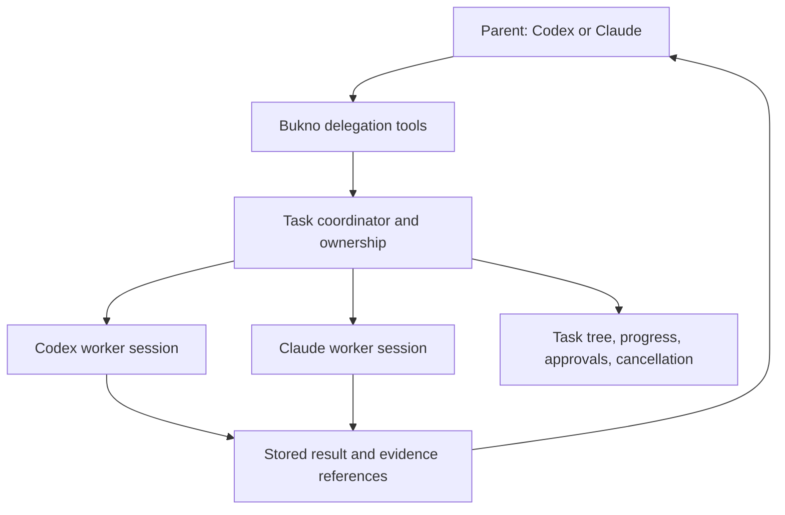

# Bukno implementation plan

Planning review, 30 September 2026; release sequence updated 1 October 2026. No application or authenticated provider flow has been implemented or tested in this review.

This document is the background and rationale. The approved [first version implementation specification](first-version-specification.md) is the single source for build order, code boundaries, and contracts ([decision 31](decisions.md)). Where the two differ, follow the specification. In particular, engine versions, data placement, permission presets, the writer lease, and the Claude bridge process model were changed there on 1 October 2026.

The approved design system is complete, and the architecture is ready for a small compatibility prototype. Before expanding the interface, prove the native UI requirements, provider contracts, and platform lifecycle. Recommendations below remain proposals unless recorded as agreed in [decisions.md](decisions.md).

## 1. Product boundary

The first useful workflow should be: start a chat with or without a project, select Codex or Claude, send a request, follow streamed work and inline results, answer an approval or question, inspect a compact change summary, cancel when needed, quit, and resume later without losing the draft or session.

Mac is the first daily-driver target. Keep portable boundaries and early Windows compilation/native UI checks, then complete Windows integration on a Windows machine before public release. Both platforms ultimately require the real packaged app and engines; compilation alone is not compatibility proof. This follows [decision 30](decisions.md).

Bukno starts as the author's daily driver and is published as open source for others to use ([decision 11](decisions.md)). The daily text flow comes first; signing, installers, and Bukno's own ChatGPT login follow.

Recommended first-release scope:

- Projects and projectless chats, persistent conversation sidebar, editable drafts, provider/model selection, and supported file/image input.
- Streaming responses and tool output, permission decisions, user questions, cancellation, and clear errors.
- Compact changed-line totals above the composer, expandable file summaries, clickable paths, and opening files in the user's editor. Embedded diffs are deferred.
- Inline Markdown, tables, code, and compact file links; previews open in the user's browser. Include a profile/settings entry and cached provider-limit snapshot.
- Reliable restart/resume, visible process ownership, engine/auth status, and completion notifications.
- Existing provider instructions, skills, and MCP configuration working through the selected engine, with enough visibility to explain failures.
- Text input for day one, with an interface boundary ready for later Codex dictation and live voice.

Recommend deferring remote hosts, worktree management, commits/PRs, schedules, history import, embedded browser/editor, rich document viewers, and plugin management. Cross-provider delegation is an architectural requirement now; its implementation milestone remains to be selected. Keep ordinary chat formatting native and open previews externally. Do not turn this into a replacement for every first-party desktop integration before the daily coding flow is dependable.

Agreed release boundary: neither dictation nor live voice is a day-one requirement. Both remain planned through Codex app-server. Their follow-up milestone establishes the exact protocol, authentication, draft handling, and audio behavior without delaying the first text release.

## 2. Platform and UI contract

Recommended initial targets are Apple Silicon macOS and Windows 11 x64 with native engines. Select exact minimum OS versions after checking the UI, audio, runtime, and engine requirements. Decide Intel Mac and Windows ARM64 explicitly. Keep Linux and WSL outside the first acceptance matrix unless requested.

Codex documents native Windows sandbox support and recommends Windows 11. Claude documents native Windows execution, with optional Git Bash and PowerShell fallback, but no native Windows sandbox. The UI must distinguish approval rules from OS isolation instead of presenting the two engines as having identical protection. Sources: [Codex Windows](https://learn.chatgpt.com/docs/windows/windows-sandbox), [Claude setup](https://code.claude.com/docs/en/setup).

The interface is native Rust; webview shells are out because low memory use is a core goal ([decision 13](decisions.md)). Evaluate egui/eframe first in a time-boxed Mac spike, with an early native Windows UI smoke check before expanding the component set. Full Windows provider integration follows the Mac daily driver. Egui supports both platforms and exposes accessibility through AccessKit; that does not prove Bukno's eventual controls are accessible. Known weak spots to test first are text selection across a long streamed transcript and IME input on Windows. If egui fails a must-have, move to another native Rust toolkit rather than work around it. GPUI, the framework behind Zed, is the first fallback candidate; check its current Windows and accessibility support at that point. A consistent custom look is acceptable. Sources: [egui](https://github.com/emilk/egui), [GPUI](https://www.gpui.rs/).

The prototype must demonstrate selection across a streamed transcript, copy/paste, long code blocks, links, draft undo, Swedish characters, IME composition, keyboard-only operation, VoiceOver/Narrator, display scaling, and scrolling without jumps while output arrives. Include a large synthetic conversation and bounded output rendering.

Specify platform behavior for executable discovery outside a terminal, paths containing spaces/non-ASCII text, drive letters, case sensitivity, line endings, shell selection, file dialogs, editor opening, notifications, microphone permissions, sleep/wake, and display/device changes. Store paths as platform paths, not shell command strings.

### Interface direction from the mockup review

The user selected the dark three-column direction. The canonical design inputs are saved in this repository: [latest mockup](design/06-warm-composer.png), [ChatGPT composer reference](design/reference-chatgpt-composer.png), and [prompts and handoff metadata](design/06-revision-and-handoff.json). Relative links let another checkout find them without Rasmus's local artifact directory. Earlier exploratory revisions remain in the external artifact archive. This revision incorporates decisions 21 to 28: warm grey surfaces, no embedded preview, simpler sidebar rows, a compact lightning/model/effort control without a provider logo, and reduced bottom insets. It is a design reference, not a working application. Usage figures, model settings, and task activity are synthetic examples. The open reasoning picker and real animations are not demonstrated in this image.

| Area | Behavior |
|---|---|
| Left navigation | Keep New chat, expandable projects, and a separate Chats group for projectless conversations. Rows contain text plus a small owning-provider logo on the right, without chat-bubble icons or a one-sided selection border. Propose a subtle selected-row fill and a separate visible keyboard focus outline. Starting a chat must not require picking a project. |
| Conversation | Keep readable streamed text, ordinary Markdown/table/code formatting, and compact activity summaries. Remove the embedded Composer preview entirely, without a replacement panel, placeholder, or permanent preview action. Real output can have a normal external link when relevant. Preserve selection and scroll position while content arrives. |
| Delegated work | Show assignment first, then provider, state, and a concise live activity summary. Clicking a task opens its conversation in the main chat pane and targets its composer for follow-ups. Show the parent path and a back action. Do not put touched files or a second Latest update section here. Leave unused space empty. |
| Change strip | Directly above the composer, show aggregate `+100 -5` and an expand control. Expansion shows changed files and available counts, with external opening. No embedded diff view in version one. |
| Profile | Bottom-left avatar and name open settings and account details. A small adjacent usage snapshot expands to the actual windows and reset times. Anchor the entire block close to the bottom edge, with the profile row visually aligned to the composer's lower edge. |
| Provider identity | Pale blue for Codex, warm orange for Claude, warm neutral chrome. Keep owning-provider logos in navigation and agent/task areas, with accessible names and tooltips. Do not repeat a provider logo in the composer. Color never carries identity or status alone. |
| Model control | One provider-colored lightning, selected model, quieter effort label, and one chevron, tightly grouped toward the right of the composer toolbar. Opening it reveals model choices and a stepped reasoning slider. Reflect supported and effective engine settings, rather than decorative or unavailable options. |

Proposed starting palette after the warm-grey correction: canvas `#252422`, sidebar `#211F1E`, right panel `#22211F`, composer `#302F2D`, raised control `#3A3936`, primary text `#F1F0ED`, secondary text `#B6B3AD`, Codex accent `#9CCBFF`, Claude accent `#DFA07C`. These are candidate design tokens, not sampled raster values. Keep the neutral surfaces subtly warm without a brown wash; blue and orange belong to provider accents. Verify text, focus, and selected-state contrast in the actual native renderer. Use platform-appropriate window controls on macOS and Windows while preserving the same content layout. Adapt by collapsing the right panel first at narrow widths; its task state remains accessible from the chat header.

Use the supplied ChatGPT composer as a reference for a continuous rounded input surface and compact toolbar spacing, not as text to copy or a requirement to add microphone/voice controls now. Keep attachment and permission controls together on the left; group lightning/model/effort/chevron near the primary action on the right. Start with roughly 6 to 8 logical pixels between elements within the model group and a 12 to 16 pixel bottom inset for the composer/profile, then validate against native scaling, resize targets, and window controls. Preserve comfortable input padding, readable text, and the compact change strip directly above the composer.

The interface's feel belongs in first-release acceptance. Establish a small native component set for typography, spacing, surface levels, input controls, focus, and motion while building the thin shell. Apply these consistently as provider flows are added.

Use whitespace and alignment to group related content; use font weight and text color to establish importance. Keep the side panels slightly distinct from the central canvas through their surface tone. Reserve brighter surfaces and soft shadows for the composer, menus, and other controls that need elevation. Conversation and task lists should remain largely flat. Do not substitute a thin shadow ring for every removed border or put every item in a floating card.

Shadows are supporting cues, not the sole way to distinguish a control in a dark theme. Keep selected, hovered, pressed, disabled, and keyboard-focused states legible. A clear focus outline or necessary structural separator is allowed; the preference is against pervasive ornamental strokes. Validate dark surfaces and text at common macOS and Windows display scales, and keep changing counts aligned with stable digit widths.

Review interaction quality through typing, opening the model picker, switching chats, entering and leaving a child task, receiving streamed output, and expanding change summaries. Require stable layout and scroll position, immediate local feedback, and interruptible transitions. Measure the actual native shadow/motion implementation under idle and streaming workloads; effects must not cause continuous repainting when idle or hidden. No performance benefit is established by the static image.

Motion should make real work legible. The static mockup shows a frozen frame of the proposed effect:

- Give the active response one small flowing ring or softly breathing orb, colored by provider. Start with a slow 2 to 3 second loop and subtle child-task pulses; avoid filling the whole interface with competing animation.
- Animate panel disclosure over about 180 ms and state changes over 120 to 180 ms. A completed task settles into a check once, then stays still. Waiting for user input uses a steady attention state; errors and disconnected states stop the working loop.
- Replace activity summaries when provider events arrive, with a short crossfade and stable layout. Render provider-exposed public reasoning summaries, commentary, and tool events. Do not invent reasoning, progress percentages, or descriptions of work to keep the animation busy.
- An active loop means the run is active, not that a particular tool is making progress. When transport is lost, show reconnecting or outcome unknown. Keep time since the latest event available when useful.
- Respect the OS reduced-motion preference from the first release, with a static indicator and the same text information. Stop continuous repainting when hidden, minimized, or idle. Measure animation cost in the native spike.

Rasmus intends Claude to implement the final motion later; these timings and effects are a starting brief, not a model-quality ranking or an instruction to launch a worker now. Review the result in the actual native renderer on both platforms, with reduced motion and measured idle/active CPU cost.

The version-one inline contract is ordinary chat formatting: Markdown, tables, selectable code, links, and compact file actions. Full artifact previews, rendered sites, and interactive output open explicitly in the user's default browser, with an optional chosen browser such as Chrome. The embedded Composer preview card is removed. Keep existing attachment input support separate from a full preview renderer. Use lazy loading and bounded content throughout.

Open a generated preview only when its file or local URL is ready, and expose loading/failure states without opening repeated tabs on streaming updates. Serve only the intended preview directory when a local server is needed; track and clean up any server Bukno starts. Browser memory still counts toward the user's total workload, and owned preview-server processes count in Bukno benchmarks. The benefit is keeping preview rendering and a browser runtime outside the app; total memory savings must be measured. A future embedded browser requires an explicit reconsideration of the native/no-webview boundary.

### Model and reasoning picker

The compact composer control uses one lightning symbol followed immediately by the model name, a quieter selected effort label, and one chevron. The lightning is blue for Codex or orange for Claude. It replaces the provider logo inside this control; do not leave a large gap where the removed logo was. Preserve an accessible provider name and make fast-mode state explicit inside the picker. Proposed on/off treatment is filled versus outlined lightning, retaining the provider hue; unavailable state also needs a text explanation. Color alone indicates neither fast mode nor availability. Fast mode and reasoning effort remain independent settings. A selected visual state must correspond to a setting the adapter actually applies; show unavailable or pending rather than implying success.

The reasoning slider snaps to the selected model's supported levels, with keyboard adjustment and a readable current-level label. Do not invent a continuous numeric scale or imply that similarly named Codex and Claude levels are equivalent. Use XHigh, Max, Ultra, or other labels only when exposed by the selected engine/model. Models with fixed or unavailable effort should say so rather than display a nonfunctional slider.

Use a dim but legible provider color at low effort, increasing saturation/intensity toward high effort. Give the highest supported settings a subtle moving highlight or shimmer. Proposed motion scope: animate in the open picker or briefly when selecting a level; an active run can retain a restrained provider effect, while a closed picker in an idle chat stays still. Preserve the text label and static selected treatment with reduced motion. The effect indicates selected reasoning effort, not guaranteed correctness, intelligence, or progress.

Store settings per chat/task, including children. Changes made during a run should visibly apply to the next turn unless the adapter explicitly supports a safe live change. Switching providers follows the existing explicit session/handoff contract, not an invisible reassignment of an active conversation.

Usage refresh is shared per provider, account, and usage bucket, never per chat. For Codex, use an initial `account/rateLimits/read` when the engine is available, then `account/rateLimits/updated` notifications. Proposed fallback: one coalesced read when visible data is older than five minutes, including when the profile is opened or the app regains focus. Do not poll in the background while idle or launch a dormant engine only to update a bar. Deduplicate manual refreshes, honor retry/backoff responses, and clear the cache on account change. Source: [app-server account APIs](https://developers.openai.com/codex/app-server).

Keep the usage window label, reset time, source, and last-updated time. Display remaining percentage consistently, converting a supplied used percentage only when valid. Do not blend short and weekly windows into an invented single quota. The mockup simplifies this display; the finished footer needs the chosen window label, with all windows available in the profile menu. Missing data means unavailable, never zero. Establish Claude's supported limit source during its adapter proof; do not reuse desktop browser credentials or assume CodexBar's data access is part of the Agent SDK.

### Design-system and screen-story handoff

Status, 1 October 2026: done and approved as the first version. The design system, user journey screens, a local viewer and exported images are in [design/README.md](design/README.md). The brief below is kept as the record of what the pass was asked to cover.

Rasmus will have Claude expand this saved direction into a design system and a coherent set of screen stories before application implementation. This review prepares the reference and constraints only; no worker has been launched and no screen set is claimed complete.

Start from the repository's [warm-grey mockup](design/06-warm-composer.png) and [supplied composer reference](design/reference-chatgpt-composer.png). Both are in `docs/design/`, alongside the generation prompts and provenance, so this handoff does not depend on an external-drive path outside the checkout. The decision log and this specification take precedence over incidental details in generated pixels. Preserve native Rust, macOS/Windows, low memory use, warm neutral surfaces, provider accents, no ornamental borders, no embedded preview/browser/diff for version one, projectless chats, and the delegation/follow-up contract. The screenshot's model names and usage numbers are examples.

Recommended deliverables for that pass:

- Portable color, typography, spacing, radius, elevation, and motion tokens, with component states and accessible focus/reduced-motion behavior. Reusable assets should be suitable for the native renderer.
- Screens for project and projectless empty chats, Codex and Claude work in progress, and a completed conversation. Keep the closed and open model picker together, including reasoning levels and fast-mode states.
- A delegation story: parent assigns work, user opens a child, sends a follow-up, and returns to the parent as a revised result arrives. Label later-milestone features so the design does not silently expand day-one scope.
- Approval/question, cancellation, error/reconnect, and missing-engine/login states; expanded change summary; profile/settings and fresh/stale/unavailable usage snapshots.
- Narrow-window behavior and macOS/Windows chrome/scaling examples, plus motion examples for working, waiting, completion, and high effort. Include a static reduced-motion counterpart.

The design pass should resolve component proportions and interaction details without adding new product features or choosing a web framework. Application implementation remains a separate step after this reviewable screen set.

## 3. Provider and configuration contract

Recommended boundaries inside one Rust workspace:

| Component | Responsibility |
|---|---|
| Desktop interface | Presentation, input, navigation, accessible controls; never block on engine I/O |
| Coordinator | Bukno task tree, delegation/routing, session/run state, permissions, process ownership, bounded event delivery, recovery |
| Codex adapter | Version-matched app-server JSON-RPC over local stdio |
| Claude adapter and bridge | Rust process client plus a small TypeScript Agent SDK bridge controlling the installed Claude executable |
| Platform layer | Processes, credentials, paths, notifications, audio devices, external application opening |
| Local store | Bukno tasks and parent/child links, run/provider session references, ownership and result records, project associations, labels, drafts, settings, schema migrations |

Keep the Claude bridge an explicit runtime dependency. “Rust app” means Rust UI and coordinator here, not a promise that all provider integration is Rust-only. The bridge follows the T3 Code approach: the Agent SDK runs and controls the user's installed Claude Code CLI ([decision 12](decisions.md)). Build it as one self-contained executable from milestone 1, so the packaged prototype does not depend on a developer Node install or PATH ([decision 16](decisions.md)). Choose between Node single executable applications and Bun compile during milestone 1, and check redistribution terms for anything bundled.

Bukno starts its own `codex app-server` child over stdio for each Codex engine it needs, using the existing Codex CLI login. It does not attach to the shared `codex app-server daemon` or its proxy, because Bukno must own and be able to clean up everything it starts ([decision 14](decisions.md)).

Both engines update often, and Codex marks app-server as experimental. Bukno runs with whatever version is installed, keeps tolerant protocol types, records the last working version of each engine, and offers a one-click revert when a new version breaks it ([decision 32](decisions.md)). Keep CI pinned to tested versions for repeatable checks; that pin is not a runtime gate.

Define internal commands for start/resume, submit, answer approval/question, interrupt, and close; define events for text, tool progress, file changes, usage, pending decisions, completion, and failure. Include provider/session/run/request IDs and the engine version. These are Bukno contracts, not assumed wire-method names shared by the providers.

Maintain a provider capability matrix with supported, unavailable, experimental, and not-yet-verified states. Model/effort choices, images, plan mode, steering, usage, forks, child agents, permissions, MCP, skills, and speech require their own entries. Preserve provider-specific details. An unknown usage value must not be displayed as zero.

Specify which user/project settings and instructions each engine loads, their precedence, and which Bukno overrides apply only to a run. Verify the Claude SDK's configuration-loading options. Do not silently modify global provider configuration to make both engines look uniform. Codex owns Codex credentials/history; Claude owns Claude credentials/history; Bukno owns only its separately issued credentials and metadata.

Start providers on demand. Do not start one live engine session per sidebar row. Measure the actual Claude SDK process model before fixing its idle policy. Transport queues, tool output, images, and transcript views need explicit bounds, with oversized output available from disk where appropriate.

## 4. Sessions, cancellation, and Git ownership

First-release policy is one writing task per checkout by default. Read-only runs take no writer lease, and a second writer is offered Queue or Run anyway rather than blocked ([section 12 of the specification](first-version-specification.md#12-workspace-ownership-and-changes)). Another project can run independently, subject to a configurable total limit. Explicit worktree isolation can follow. The checkout guard covers Bukno tasks; it cannot prevent edits from an external editor or another app.

Switching providers creates or resumes that provider's own conversation. The UI must not imply that Claude has read a Codex conversation automatically. Cross-provider delegation and full handoff use the explicit task/context/result contract below.

Define these user-visible states: idle, starting, running, waiting for permission/input, cancelling, completed, failed, interrupted, and outcome unknown. A disconnected stream or submit timeout does not prove the task failed. Reconcile against engine state/history before offering a retry; never automatically resubmit a possibly executed coding request.

Persist the draft and provider session reference before they can be lost. Keep engine transcripts authoritative and load them lazily through supported interfaces. Recommend SQLite for Bukno metadata, with versioned migrations, recovery behavior, and a clear missing-project/missing-session state. Set retention for temporary output and diagnostics; credential values and raw audio must not enter logs. User transcripts and evidence stay out of Git.

### Projectless chats

Projectless chats are a first-release requirement. A project is an optional association; every chat still has a stable workspace identity and working directory. New chat outside a project should create this workspace automatically, then let either provider operate there. Do not use the user's entire home directory as the chat's working directory or require Git initialization.

App state, including the database, stays on the internal drive. The user chooses a work folder during onboarding for projectless chat folders, attachments, and outputs ([decision 33](decisions.md)). The layout is in [section 5 of the specification](first-version-specification.md#5-file-placement-and-application-data). Engine-owned credentials/history and installed runtimes keep their existing homes; do not copy them into Bukno's folders.

Persist provider session links, drafts, labels, and workspace paths in the local store. Separate projectless chats get separate directories; the same ownership rules apply to delegated work. Pass each engine an explicit working directory and verify its behavior outside Git. Application workspace selection is not itself an OS sandbox.

Archiving hides a chat without deleting its files. Deletion and retention need explicit product behavior; never clean up user output as a cache. If the configured drive is disconnected, show the stored chat as unavailable and preserve its identity instead of silently creating a new internal-drive workspace. Opening the workspace in Finder/Explorer belongs in the chat menu. Moving a chat into a project can follow later, with explicit handling of files and provider session working directories.

Specify the difference between closing a window and quitting the app. Recommend no detached background runner in the first release: quitting settles or cancels owned work and reports anything that could not stop. Handle macOS process groups and Windows process-tree ownership in the platform layer. Never kill a user's unrelated CLI or MCP service. Pending approvals expire when their owning run exits; they must not approve a later run accidentally.

Show current workspace change totals and, where available, changes attributed to the run. Label the scope when expanding the strip: existing dirty files and edits made during the run cannot safely be treated as agent-owned. For non-Git workspaces, use trustworthy provider change events where available; otherwise omit counts rather than manufacture a Git diff. Expansion is read-only file information in version one; no embedded diff viewer, blanket reset, automatic checkout, or whole-repository undo.

## 5. Subagent delegation and handoff

Agreed direction: Bukno should let a parent agent delegate to workers using either Codex/OpenAI or Claude, including across providers. Build the core task model for this from the beginning. The tool transport and feature delivery date remain proposals; existing provider subagent APIs alone do not establish mixed-provider delegation.

Bukno supplies the coordination layer while each provider keeps its own agent loop, tools, authentication, and conversation state. “ChatGPT models” here means models available through the selected Codex/OpenAI route, not access to ChatGPT web conversations or a new third engine.

Separate two operations. Delegation gives a child a bounded assignment and returns its result to a parent that remains responsible. A full handoff transfers responsibility and releases the source's execution ownership. Support delegation first; do not silently turn it into an untracked independent conversation.

Recommended agent-facing surface: a small local MCP tool set backed by the Rust coordinator, available to both engines. Candidate operations are `delegate_task`, `task_status`, `wait_task`, and `cancel_task`; these are proposed Bukno names. Both engines document MCP support, which makes this a plausible shared entry point, not a verified Bukno integration. Keep the underlying Rust coordinator API independent of MCP so a provider-specific tool bridge can use the same task rules if needed. Sources: [Codex MCP](https://developers.openai.com/codex/mcp), [Claude SDK MCP](https://code.claude.com/docs/en/agent-sdk/mcp).

Before enabling delegation, specify these contracts:

| Contract | Recommended starting behavior |
|---|---|
| Task identity | Persist Bukno task ID, optional parent ID, run/attempt ID, host/workspace identity, provider/model, provider session ID, lifecycle state, and result references. Provider session IDs are not Bukno task IDs. |
| Task brief | Include objective, explicit context summary, selected files/artifacts, expected output, and allowed workspace/actions. Do not copy all parent history or credentials by default. |
| Provider selection | Let the user select a worker provider/model or allow the parent to choose within configured bounds. Resolve models from that provider's catalog; show unavailable authentication/limits rather than silently change provider or billing. |
| Invocation | Authenticate/bind the tool caller to its owning Bukno run. Validate permission, depth, capacity, and a persisted request key before creating a child. Repeated delivery of that key returns the existing task. |
| Results | Store terminal status, concise summary, changed-file/diff references, verification evidence, and unresolved issues. Return them to the owning parent through its adapter with delivery bookkeeping and acknowledgement. Never label a child successful based only on process exit or a claimed summary. |
| Direct user follow-up | Open the child as the active chat, with its own draft and model settings. Route user messages to that child only, preserving parent/task identity. Record follow-up attempts and result revisions so the parent can distinguish an earlier result from current work. |
| Limits | Begin with one delegation level and a small configurable worker cap. Children cannot gain broader permission than the parent policy allows. Carry shared runtime/usage limits where measurable; never claim a hard monetary cap when usage data is unavailable. |
| Editing | Begin the delegation proof with read-only work. A writing child requires the sole checkout writer lease while the parent pauses writes, or an explicitly isolated worktree. Parallel edits need isolated workspaces and a later merge/review step. |
| Cancellation/recovery | Parent cancellation stops its owned children by default. Persist pending results and reconcile unfinished tasks after restart without automatically rerunning possibly completed work. Expire approvals with their owning run. |

Return a task ID promptly from delegation. Waiting must not block the UI or hold the only scheduler slot needed by the child. A parent may do independent permitted work while a child runs; its workspace ownership still constrains edits. Deliver completed results at a provider-supported input boundary, with explicit handling for an already-running parent or a parent that has ended. Do not assume identical steering/resume behavior in Codex and Claude. Both engines time out long MCP tool calls, so `wait_task` must return within a short bounded wait and be called again, rather than block until the child finishes.

### Opening and following up with a delegated task

Selecting a child changes the main chat pane and composer recipient; it does not pause or cancel the parent. Show a breadcrumb such as the parent title followed by the child assignment, an obvious Back to parent action, and the child's provider/model. Preserve independent draft, scroll, and pending-message state for each chat. The child does not need a duplicate top-level sidebar row to be directly addressable.

Bind each outgoing follow-up to the selected task ID at submission and persist its delivery state, so navigating away cannot redirect it to another task. For a running child, use supported steering or visibly queue the message; do not promise identical immediate interruption on both engines. For a completed child, resume its supported provider session as a new run/attempt under the same Bukno task. If that session cannot resume, show the limitation and offer explicit continuation with context instead of silently creating a contextless worker. Retry must not send the same follow-up twice.

Keep user and parent messages ordered through the coordinator. When the user reopens completed child work, record that a revision is in progress and notify the parent at a supported input boundary. Retain the previous result as history, then deliver the revised result with a new revision ID when complete. If the parent already finished, surface the update without automatically restarting its work. Neither viewing a child nor sending a follow-up grants it new permissions or bypasses workspace writer ownership.

Provider-native children and Bukno-managed cross-provider workers are different ownership paths. Show native children when exposed and avoid launching duplicates. Establish how native subagent behavior participates in limits before promising a global cap; restrict nested delegation where it cannot be accounted for. All owned descendants still count in memory measurements.

Architecture work for the initial build: task/run identity, optional parent link, provider-independent lifecycle, ownership, result references, and a coordinator command boundary. Do not build a distributed scheduler or full agent-management UI just to reserve these foundations.

First delegation proof: Codex asks a Claude worker to inspect a disposable project, receives evidence, and continues; repeat Claude to Codex and both same-provider combinations on macOS and Windows. Open a child in the chat pane, send a follow-up, return to the parent, and verify the revised result reaches it. Exercise running/completed children, navigation during send, separate drafts, worker failure, duplicate invocation, parent cancellation, restart, and delayed result delivery. Editing delegation gets its own writer-ownership/worktree proof. Record the visible task tree and completed parent result. Select this milestone separately from day-one text and later speech work.

## 6. Authentication and speech gates

Keep a result matrix for each auth route and platform: login, completed text/tool turn, restart/resume, token renewal, logout, dictation, and realtime voice. A model list or successful connection is insufficient.

The daily driver uses the existing Codex CLI login through Bukno's own app-server child. Bukno's own Sign in with ChatGPT client, described next, is a public-release item.

Engine distribution and authentication are independent decisions. Running the installed CLI avoids shipping/updating an extra engine and follows the user's CLI version. Bundling a tested engine provides version control but adds packaging, updates, and redistribution work. Neither location inherently grants or removes voice access. A bundled engine can use an engine-managed login where supported; bundling does not require the third-party ChatGPT token route. Keep installed engines as agreed for the first milestone.

For the documented Sign in with ChatGPT app-server configuration, Bukno owns token refresh and restarts app-server with the renewed token before resuming the saved thread. Design renewal across all affected sessions; do not kill active work or duplicate a turn during refresh. Source: [OpenAI app-server recipe](https://developers.openai.com/siwc/token-sharing-open-source/codex-app-server).

That third-party ChatGPT plan route to `api.openai.com/v1` excludes audio/video input and transcription, as well as several hosted tools. It still supports local agent tools within its documented limits. These restrictions belong to the route, not to whether the binary is bundled. Source: [OpenAI preview limitations](https://developers.openai.com/siwc/token-sharing-open-source/preview-limitations).

The [speech follow-up](research/README.md#speech-follow-up) found a specific integration gap. Public source for both installed CLI 0.158.0 and desktop-bundled 0.159.2 requires API-key authentication for default WebSocket realtime. The desktop app also contains a client-owned WebRTC call path connected to app-server using `existingCall`, and a separate dictation client using streaming transcription or recorded-audio upload. It is therefore inaccurate to assume the bundled binary alone contains the complete first-party speech experience. No account, voice call, or microphone flow was exercised in this inspection.

The public source includes `gpt-live-1-codex`, a transcription session mode, and multiple voice transports. Investigate the supported WebRTC/app-server path with engine-managed ChatGPT authentication before choosing an API-key alternative. Service eligibility and draft-only behavior must be proved separately. Do not copy the first-party client identity, silently change billing, or treat observed desktop service paths as a documented third-party API. A new speech backend remains a scope decision, not an automatic workaround.

Claude follows the T3 Code approach ([decision 12](decisions.md)): Bukno drives the user's own installed Claude Code CLI through the Agent SDK, and users sign in through Claude Code itself. Bukno does not offer its own Claude login and never stores Claude credentials. Keep API-key use an explicit alternative with separate billing, never an automatic fallback. Sources: [SDK overview](https://code.claude.com/docs/en/agent-sdk/overview), [subscription usage](https://support.claude.com/en/articles/15036540-use-the-claude-agent-sdk-with-your-claude-plan).

Dictation must be a draft-only mode by construction. Establish a protocol-level way to prevent task delegation, startup/end actions, and automatic submission; a prompt saying “only transcribe” is insufficient. Test stopping halfway through speech, lost connections, late transcript fragments, device removal, and switching the selected provider. Text must land in the intended draft exactly once. Any unresolved protocol behavior remains speech integration work and does not block the first text release.

Live Codex voice is a distinct mode that may trigger work. Show its thread and tool activity, support interruption, and verify microphone/playback release on stop and crash. Test English, Swedish, and code identifiers on both systems. Do not add a separate Claude or transcription backend to work around a failed proof without a new decision.

## 7. Implementation sequence and evidence

| Stage | Work | Exit evidence |
|---|---|---|
| A. Resolve contracts | Apply text-first boundary; define delegation-ready task model; select OS matrix, initial permission policy, quit behavior | Updated decisions and a per-provider acceptance matrix |
| B. Native shell | Small packaged Mac app and text-heavy UI prototype; early Windows build/UI checks | Launch/input/accessibility recordings; startup, idle CPU/memory measurements |
| C. Two text engines on Mac | Codex flow followed by the same Claude flow; project and projectless workspaces, approvals, cancellation, resume, change summaries | Real edits in disposable Mac workspaces, logs and final diffs |
| D. Mac daily use | Persistence, conversation/project UI, inline content, motion, profile/usage, model/settings, attachments, notifications, failure recovery | Repeatable full Mac workflow after quit/relaunch, loss of network, and engine failure |
| E. Windows and distribution | Native Windows provider parity, install/update behavior, signing/notarization, runtime dependencies, compatibility diagnostics | Full real-machine Windows evidence, clean-user installation on both platforms, version manifest, release checklist |
| F. Speech integration | Codex dictation and voice, through each intended auth route, after the text release | Transcript/draft evidence, voice task result, interruption and resource-release results |

The delivery order now follows [decision 30](decisions.md): thin Codex version on Mac, then Claude, then Mac daily-driver hardening, then full Windows integration and public distribution. The [first milestone](first-milestone.md) and [first version specification](first-version-specification.md) define the checkpoints. Early Windows compilation and native UI checks reduce platform risk without requiring complete provider parity before daily Mac use.

Delegation is a separate feature milestone to place once the two provider flows work. Its foundations belong in stage A and the first coordinator/store implementation; its acceptance flow is defined above. It need not wait for speech.

Before adapter implementation, enumerate failures: missing executable/runtime, incompatible engine/protocol, expired login, unsupported capability, shell/path failure, rejected/stale approval, unanswered question, cancellation race, lost/oversized stream, bridge/engine crash, unknown submit outcome, duplicate retry, and restart with unfinished work. Then verify these through real end-to-end flows where feasible. Do not add unit tests as a default follow-up.

Use the same disposable fixture and prompt sequence for each provider/OS comparison. Include an existing unrelated dirty file, a path with spaces and Swedish characters, a long tool output, an approval that is declined, a stopped run, and a resumed session. Keep setup, exact steps, expected results, observed results, engine/build/OS versions, final diffs, and redacted logs together under `/Volumes/TOSHIBA Workspace/dev/artifacts/bukno/`. Windows evidence should be retained with the same manifest in the project's artifact set. Use synthetic prompts rather than private customer material.

Add macOS and Windows build checks from the initial implementation. Building in CI is a separate result from an authenticated engine or microphone test on a real machine.

Benchmark the baseline desktop app and Bukno with the same repository, prompts, model/settings, number of active tasks, inactive conversations, and enabled integrations. Measure cold start, time to first visible output, idle/streaming CPU, UI responsiveness, and memory before/during/after repeated cycles. Include the GUI, bridge/runtime, engines, and owned tool children; record the platform metric and do not equate summed RSS with unique memory. Keep the existing 100 MiB GUI and 500 MiB basic Codex totals as provisional targets. Select Claude's total budget after measuring it.

Keep source/manifests/lockfiles here on Toshiba. On this Mac, installed tools, dependencies, caches, and compiler output use configured internal-drive locations. Retain reviewable evidence in the Bukno artifact folder. No implementation dependency installation is needed to finish this planning step.

## Decisions needed before the full build

Resolved after the audit: custom-look native Rust UI, auth route for the daily driver, Claude integration approach, and bridge runtime strategy. See decisions 11 to 17 in [decisions.md](decisions.md).

1. Which OS versions and architectures are supported first, and is native Windows the agreed execution environment?
2. Resolved by [decision 31](decisions.md): provider-specific conversations, the writer lease with Queue or Run anyway, no detached runner, and per-provider permission presets.
3. Select the delegation milestone and initial defaults for worker count, model choice, context transfer, and read-only versus editing assignments. Cross-provider support in the architecture is already agreed.

Do not postpone the compatibility prototype until every later feature is specified. Start with the small Mac app, prove the risky native UI and provider integrations, and use those results to finalize the toolkit and release promises. Keep the early Windows foundation check and the later full Windows acceptance gate distinct.
