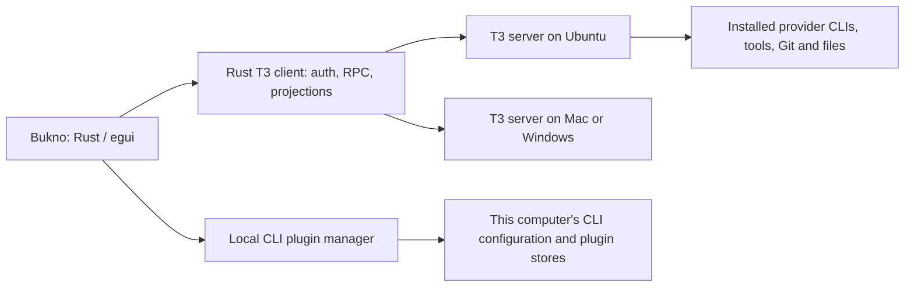

# Bukno as a native T3 client

Audit and proposed plan, 3 October 2026. Requested direction, not an implemented
backend migration. The existing direct Codex app remains available while the
T3 client is proven. This document proposes replacing the backend portions of
the approved first-version specification; its UI requirements still apply.

## Recommendation

Keep Bukno's Rust/egui interface and use an unmodified T3 server for execution,
provider adapters, durable conversations, approvals, queues, delegation, and
recovery. Start by connecting to the existing Ubuntu T3 server. Prove the client
before adding a managed headless server or maintaining a T3 fork.

This removes substantial unfinished work. Bukno already has a native transcript,
composer, design system, SQLite persistence, coordinator, and working Mac Codex
adapter. Claude integration and Bukno-owned cross-provider delegation remain
unfinished. T3 already provides those backend mechanisms. Reuse the UI, but
replace its coordinator boundary rather than nesting two orchestration engines.

It will still be a Rust frontend with a Node backend. Removing Electron is a
potential memory saving, not evidence that the whole application is lightweight.
Initially, attaching to the desktop-hosted server leaves Electron running.

## What was checked

- Bukno source at local HEAD `021fe79a2b1a84b13d797d142ec57f828fd86335`, its
  README, decisions, milestone, and current platform/provider/runtime code.
- Installed T3 `0.0.46-nightly.20261003.2623`, source revision
  `fed41fa88bb27cb4325cb208d571393850bc63c2`. The revision comes from its
  packaged metadata. Upstream main was also inspected and recorded separately.
- The live environment descriptor reports orchestration protocol 2. Both
  loopback and this Ubuntu machine's tailnet address returned HTTP 200 at port
  3774. That is discovery/reachability evidence, not a native-client login test.
- The current authenticated T3 MCP catalog reports Codex and Claude available,
  cross-provider children, thread management, cancellation, incremental reads,
  and scheduling. No new delegated task or provider run was created for this audit.
- Installed Codex CLI `0.160.0` and Claude Code `2.1.288`. Read-only JSON plugin
  inventory succeeded for both. Installation, removal, and active-session
  plugin reload were not exercised.

Raw audit evidence is outside Git in `dev/artifacts/bukno/2026-10-03/t3-audit/`.
Source/schema observations below are not authenticated end-to-end proof.

## Fit against Bukno

| Requirement | T3 fit | Bukno work or remaining proof |
|---|---|---|
| Native Rust UI, selected design, inline Markdown | UI remains ours | Keep transcript, composer, themes, activity treatment, navigation, external previews |
| Codex and Claude through installed CLIs | Backend adapters already exist | Read provider availability, models, options and errors from the selected environment |
| Saved chats, streaming, stop, questions, approvals | V2 commands and subscriptions | Translate projections into UI items and send request-ID-bound responses |
| Queueing and steering | V2 message dispatch modes | Expose the applicable actions without creating another scheduler |
| Same-provider and cross-provider delegated work | App-owned delegated tasks and child threads | Show lineage, child progress, child approvals, separate drafts and follow-ups |
| Projects, Git, worktrees and checkpoints | Server-owned services | Use host paths and server operations; retain Bukno's compact change display |
| Projectless chats with one persistent folder each | T3 threads belong to projects | Prove a normal managed workspace registered as a project; hide its grouping in Bukno. Verify non-Git operation or disclose a required Git workspace |
| Multiple machines | Environment identity, pairing and remote transport exist | Build environment catalog, connection status, target-aware paths and per-environment caches |
| Usage and profile | Provider/runtime configuration and usage-limit facilities exist | Render host-reported values and timestamps; do not imply a unified provider login |
| CLI plugin management | No plugin lifecycle RPC found in the inspected T3 contract | Add a separate local manager; verify plugins actually load through T3's provider adapters |
| Engine revert | T3 has provider update/settings facilities | Bukno's exact one-click last-working-engine promise needs a separate proof and policy |
| Dictation and live voice | No matching speech client contract found in the inspected T3 RPC surface | Keep the existing later speech investigation; no automatic carry-over from text support |

T3's orchestration is environment-local. Connecting several machines does not
establish cross-machine child delegation, automatic repository synchronization,
or portable provider sessions. Treat these as separate future features.

## Connection boundary

The application boundary is T3's client protocol, not the agent MCP endpoint.
MCP credentials are scoped to an existing provider session/thread and are not a
general-purpose frontend login. Do not reuse this chat's credential in Bukno.

The initial Rust client needs this minimum surface from the pinned contracts:

1. Read `/.well-known/t3/environment`; verify identity, protocol and capabilities.
2. Exchange a user-provided pairing credential through `/oauth/token`; keep the
   resulting credential in the platform secret store. Tokens stay out of logs,
   screenshots, source and Toshiba. Direct pairing and cloud identity are distinct.
3. Request `/api/auth/websocket-ticket`, then connect to `/ws` with the supported
   orchestration protocol parameter. Honor the server's advertised auth methods.
4. Implement the pinned Effect RPC JSON framing, request/stream lifecycle,
   interruption and acknowledgement rules. This is not a plain JSON-RPC socket.
5. Read/subscribe to server config, `orchestration.subscribeShell` and the selected
   `orchestration.subscribeThread`; use `afterSequence` for catch-up. Handle
   bounded history and completion markers before reporting data as current.
6. Use `orchestration.launchThread` and `orchestration.dispatchCommand` for
   creation, messages, interruption and `runtime-request.respond`. Keep stable
   command IDs when retrying an ambiguous dispatch; acceptance is not completion.

Implement a narrow client first, with serde types for the consumed contract and
an explicit unknown-event path. Record the source revision and fixtures used by
the client. Protocol 2 alone does not guarantee every optional capability or
wire change is supported. Use capability checks and repeatable compatibility
flows against supported server builds. No Rust client SDK was identified in the
inspected repository; the shared upstream client runtime is TypeScript/Effect.

The frontend still owns substantial connection logic: authentication renewal,
one retry loop per environment, cancellation, subscription backpressure,
sequence deduplication, sleep/wake and offline caches. Keep drafts separate from
server-owned history. Do not replay mutations automatically after reconnecting.

## Tailscale first, T3 Connect later

Direct Tailscale pairing uses the same environment protocol. Tailscale supplies
reachability and encrypted transport, while T3 pairing supplies application
authorization. Bukno does not need to implement a VPN. Initially the user can
paste a reachable endpoint and a fresh pairing link into Add environment.

Ubuntu currently has T3 listening on port 3774 and tailnet address
`100.127.119.35`. Treat both as discovery results, not hardcoded defaults. Do not
change the running server's binding, service, sessions or Tailscale Serve
configuration during the frontend spike. No other machine was reconfigured.

Prefer a trusted HTTPS/WSS endpoint for remote access where available. A native
HTTP client does not have a browser's HTTPS mixed-content restriction, but that
does not remove the need for authentication and trusted transport. T3 documents
`t3 pair --tailscale` for setting up Tailscale Serve when it is needed.

T3 Connect adds Clerk identity, relay discovery, environment linking, DPoP-bound
bootstrap credentials and managed Cloudflare tunnels. The relay brokers access;
application traffic goes to the environment's tunnel hostname. Some current
desktop login code uses Electron-specific integration. Open source availability
does not establish that a separately branded native app can use T3's hosted
identity/client registration unchanged. Prove the permitted native sign-in and
broker integration before promising T3 Connect parity. Direct Tailscale remains
useful without that dependency. Desktop-managed SSH also needs a native process
supervisor and is a later connection feature.

## Plugin management

Start with **This computer**, with distinct Codex and Claude sections and an
explicit project context where supported. A remote agent reads plugins on the
remote host; installing a plugin on the frontend computer does not install it
on the selected remote environment. Show that distinction in the UI.

| Provider | Observed installed interface | Proposed approach |
|---|---|---|
| Codex 0.160.0 | `plugin list --json`, `add --json`, `remove --json`, marketplace commands | Use CLI lifecycle operations. Enable/disable through supported configuration editing, preserving unrelated TOML and precedence; top-level `--enable` toggles feature flags, not plugins |
| Claude Code 2.1.288 | `plugin list --json`, install/uninstall/update/enable/disable with scope options | Use CLI operations and user/project/local scope; retain structured error and confirmation responses |

The Codex-generated experimental app-server schema also contains plugin
list/search/read/install/uninstall/reconcile methods. That is another possible
management interface, not a reason to start a second inference runtime. Prefer
the CLI for the first local manager and reassess where configuration editing
cannot express an operation safely.

Read inventory before applying changes and verify it afterwards. Serialize
writes per provider/configuration root, preserve unrelated settings, and show
managed/read-only restrictions. Avoid direct edits to cache directories or
provider-owned installation databases. An install may require downloads,
dependency setup, user configuration or service authentication. Preserve any
CLI-required command review rather than automatically accepting it.

Installed and enabled does not establish loaded in an active T3 session. Prove
that a benign plugin's skill and tool are visible through each T3 adapter, at
user and project scope, and determine whether a new session or a supported
reload is needed. The inspected T3 configuration includes skills and slash
commands, but that is not a plugin installation API.

Later remote management should be a small authenticated host-side management
service, preferably upstream T3 RPCs using the same CLI operations. Use explicit
host targeting, a dedicated management capability and per-host results. Do not
edit remote home folders over the shared drive, and do not promise global
configuration synchronization for offline devices.

## Code and data transition

- Keep `apps/desktop`, the transcript widget, design assets and portable platform
  services. Introduce `crates/t3-client` for wire contracts, authenticated
  transport, subscriptions and projection mapping.
- Move the UI off direct `UiCommand`/coordinator assumptions through one client
  boundary. Replace numeric Bukno-only identities with environment-qualified
  T3 project/thread/run/request IDs. Qualify drafts, selections and caches too.
- Retain only client preferences, connection references, drafts and expendable
  projection caches in local storage. T3 is authoritative for thread/run state,
  approvals, outbox effects, workspace ownership and provider history.
- Keep the existing direct adapter and database during the proof phase. Preserve
  old Bukno chats read-only or export them; do not claim provider-native resume
  or a T3 importer is proven. Never copy a live T3 database into Bukno or let two
  servers use the same database.
- Do not implement the separate Claude bridge or Bukno delegation engine while
  evaluating this route. Retire the legacy runtime only after replacement flows
  pass, with a reversible data transition.
- Attach to an existing server first. Afterwards offer a pinned, supported
  headless T3 distribution/service for machines where Bukno should be the only
  UI. Do not launch private files extracted from Electron's archive in production.
  Owned versus attached servers need different quit behavior: closing a client
  must not kill a shared host's agents.

On this Ubuntu devbox, execution workspaces must also obey the Toshiba workflow.
Register internal Linux working copies with T3, with an explicit reservation and
verified export back to canonical source. Pointing T3's Git/worktree services
straight at the SMB repository would bypass that requirement. Resolve the
currently stalled `devbox-local` import before implementing the larger client.
T3-created linked worktrees need the supported project-specific synchronization
plan required by the machine instructions; the ordinary helper rejects them.
Use an internal disposable repository for the first client proof. This host
workspace integration is distinct from orchestration and from Tailscale routing.

T3's inspected license is MIT. Keep its copyright/license and dependency notices
when distributing code or server binaries. Bukno can retain its current license.
Licensing of source does not settle hosted-service registration or branding.

## Delivery order and acceptance

| Stage | Concrete result | Acceptance evidence |
|---|---|---|
| 0. Ubuntu foundation | Current native app builds and opens on Ubuntu | Native frame, existing UI flow, live direct Codex flow, cleanup and restart evidence; documented gaps |
| 1. Read-only T3 client | Pair with the existing server, list projects/threads/models and open one thread | Same thread content as T3; paged history; disconnect/reconnect without duplicate items or mutation |
| 2. Full local text flow | Create/send/stream, questions, allow/deny, stop, queue/steer, drafts and resume for both providers | Disposable repository; preserved dirty file; app restart; backend restart; ambiguous dispatch; no duplicate execution |
| 3. Delegated work | Show T3 children and follow-ups in Bukno | Both provider directions; correct recipient/draft; child approvals; completion versus waiting; parent/child cancellation policy |
| 4. Direct remote environments | Pair Ubuntu, Mac and Windows over Tailscale | Actual host identity and host-local workspace; route failure; revocation; host sleep/wake; local and remote state stay distinct |
| 5. Local plugins | Inventory, marketplaces, lifecycle and scope in native settings | Benign disposable plugin install/enable/disable/remove; unrelated config preserved; provider actually loads the plugin through T3 |
| 6. Standalone daily driver | Managed headless backend and packaged native launch | No Electron requirement; versions pinned; service ownership; updates and recovery; measured complete process family |
| Later | T3 Connect parity, remote plugin management, speech | Separate authenticated proof and scope decision for each |

Enumerate adapter failure paths before implementing the Rust transport. Include
expired/revoked credentials, wrong environment identity, protocol mismatch,
unknown frames, slow consumers, cursor gaps, lost acknowledgement, disconnected
approval cards and server restarts. Verify these through actual system flows;
do not add unit tests as an automatic follow-up.

Benchmark the same repository, transcript length, models and number of active
agents before making memory claims. Report native UI, Node backend, provider
engines and tool children separately and together. For a shared server, also
report the full shared host cost; do not count only Bukno's incremental process.

The first decision gate is Stage 2. If the native client proves both providers,
approval safety and recovery with acceptable maintenance cost, adopt the T3
backend and rewrite the approved backend specification. Keep upstream unchanged
until a concrete missing capability is proven. Try an upstream contribution or
a narrow management extension before maintaining an orchestration fork.

## Primary references

- [Pinned T3 architecture](https://github.com/pingdotgg/t3code/blob/fed41fa88bb27cb4325cb208d571393850bc63c2/docs/internals/overview.md)
- [Pinned RPC contract](https://github.com/pingdotgg/t3code/blob/fed41fa88bb27cb4325cb208d571393850bc63c2/packages/contracts/src/rpc.ts)
- [Pinned V2 commands and subscriptions](https://github.com/pingdotgg/t3code/blob/fed41fa88bb27cb4325cb208d571393850bc63c2/packages/contracts/src/orchestrationV2.ts)
- [Pinned environment authentication](https://github.com/pingdotgg/t3code/blob/fed41fa88bb27cb4325cb208d571393850bc63c2/docs/internals/environment-auth.md)
- [Pinned remote access](https://github.com/pingdotgg/t3code/blob/fed41fa88bb27cb4325cb208d571393850bc63c2/docs/user/remote-access.md)
- [Pinned T3 Connect](https://github.com/pingdotgg/t3code/blob/fed41fa88bb27cb4325cb208d571393850bc63c2/docs/internals/t3-connect.md)
- [Codex plugin packaging and configuration](https://developers.openai.com/plugins/build/plugins)
- [Codex app-server](https://learn.chatgpt.com/docs/app-server)
- [Claude plugin reference](https://code.claude.com/docs/en/plugins-reference)

Local CLI help and generated schemas describe the observed installed versions;
they take precedence over assumptions based on older documentation. None of
this audit demonstrates service eligibility for a new Bukno cloud client.
